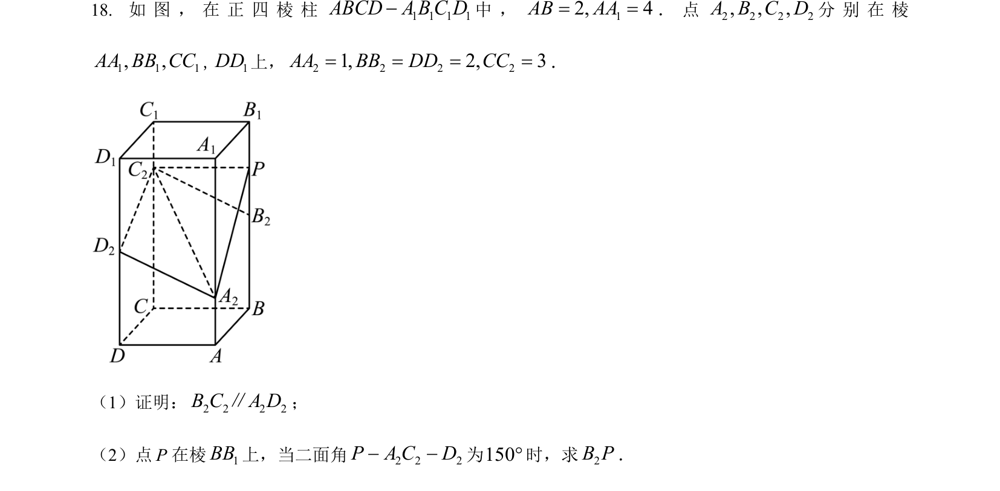
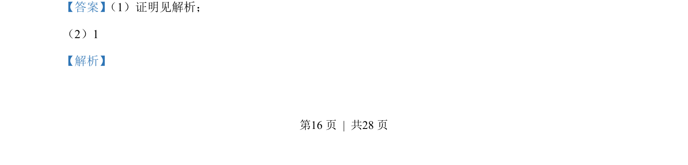
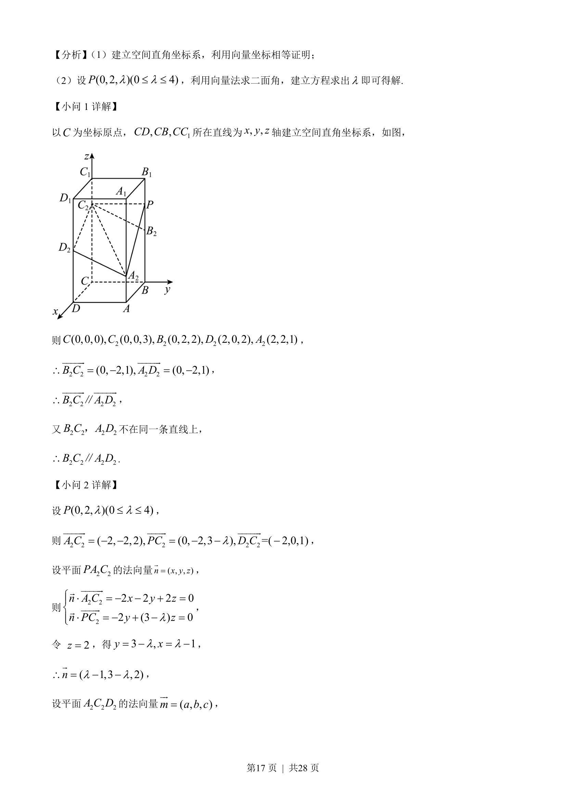
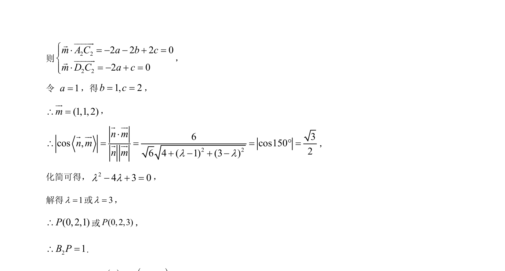

## 题面

## 摘要

本题为立体几何，建立空间直角坐标系，用向量法证明线线平行，设参数利用二面角求解点坐标。

## 关联考点

- [[399-空间向量坐标表示|空间直角坐标系]]
- [[向量法证明平行]]
- [[向量法求二面角]]
- [[061-方程|参数方程]]

## 答案与解析

> 📄 原 PDF 第 16 页：`素材/真题/湖南/2008-2024·（湖南）数学高考真题/2023年高考数学试卷（新课标Ⅰ卷）（解析卷）.pdf`

<!-- 题干文本-start -->
## 题干文本
18. 如 图 ， 在 正 四 棱 柱 1 1 1 1ABCD A B C D-中 ， 12, 4AB AA= =． 点2 2 2 2, , ,A B C D分 别 在 棱
1 1 1, ,AA BB CC,1DD上，2 2 2 21, 2, 3AA BB DD CC= = = =．
  
（1）证明：2 2 2 2B C A D∥；
（2）点P在棱1BB上，当二面角 2 2 2P A C D- -为150°时，求2B P．
<!-- 题干文本-end -->

<!-- 解析文本-start -->
## 解析文本
【答案】 （1）证明见解析；    
（2）1
【解析】
<!-- 解析文本-end -->
