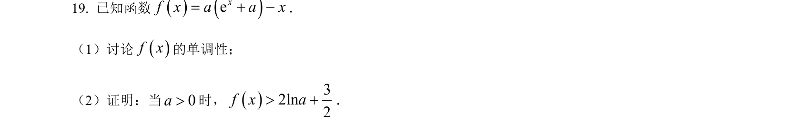
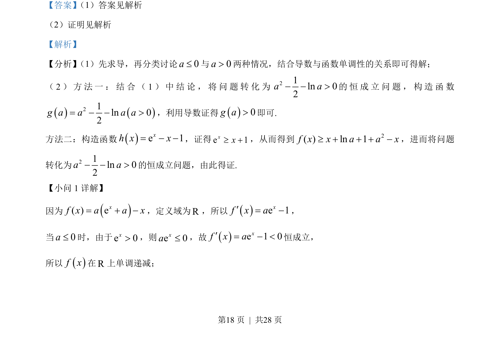
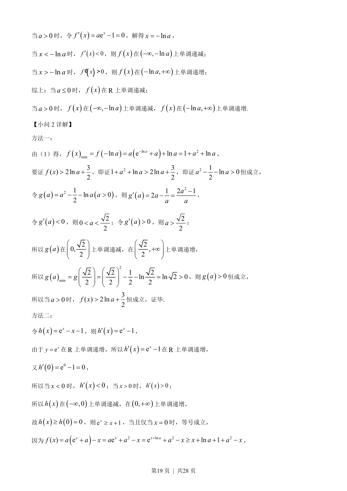
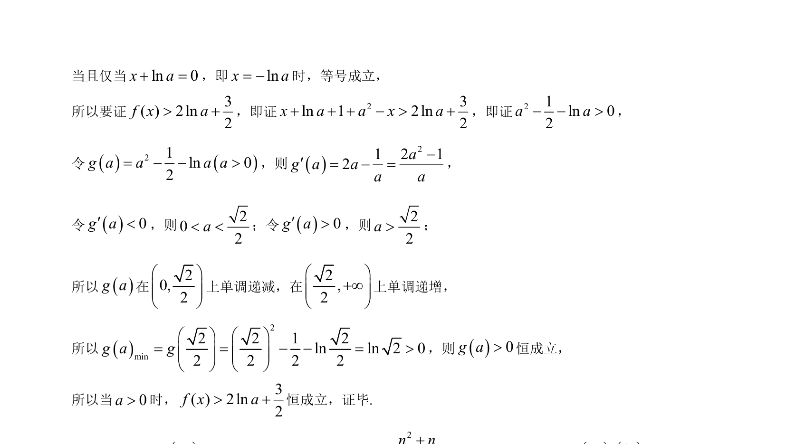

## 题面

## 摘要

本题考查含参函数单调性讨论及利用导数证明不等式恒成立问题。

## 关联考点

- [[705-利用导数研究函数的单调性|导数与单调性]]
- [[424-参数分类讨论|分类讨论]]
- [[923-构造函数|构造函数]]
- [[625-不等式证明|不等式证明]]

## 答案与解析

> 📄 原 PDF 第 18 页：`素材/真题/湖南/2008-2024·（湖南）数学高考真题/2023年高考数学试卷（新课标Ⅰ卷）（解析卷）.pdf`
