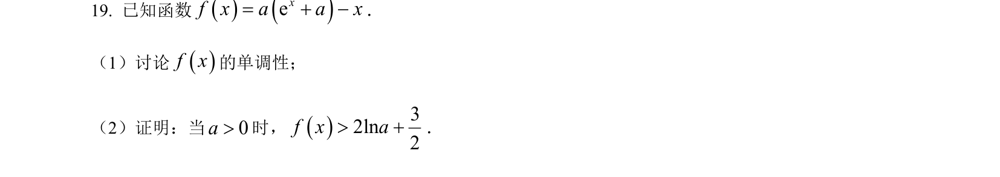
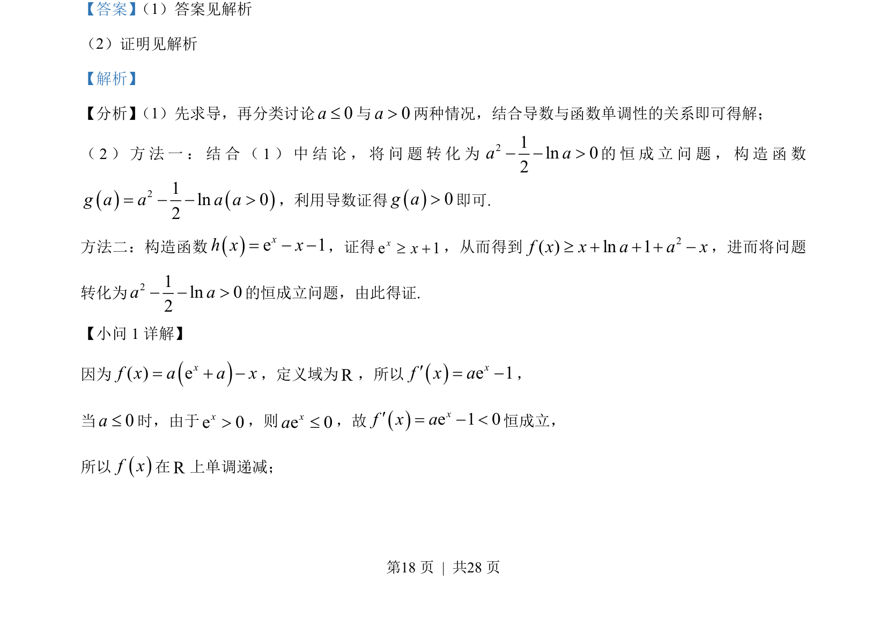
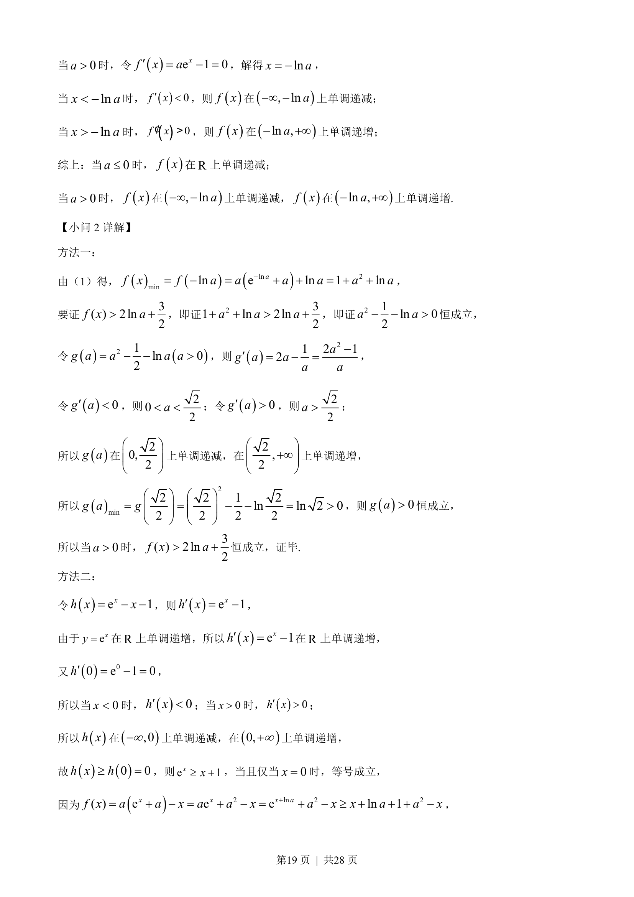
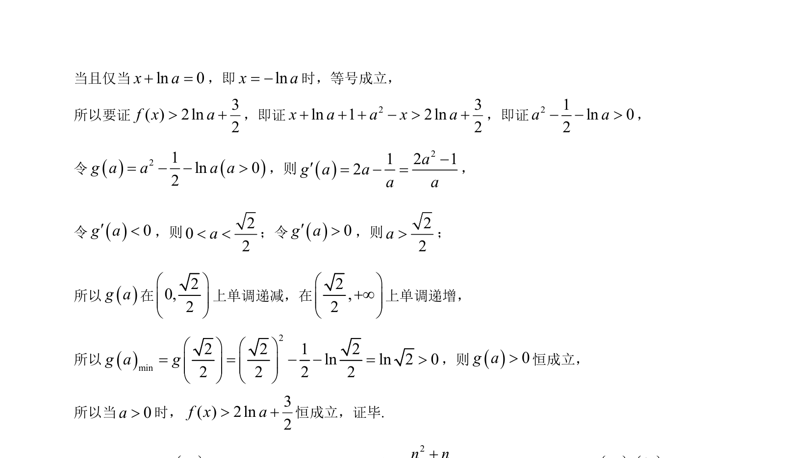

## 题面

## 摘要

本题考查含参函数单调性讨论及利用导数证明不等式恒成立问题。

## 关联考点

- [[705-利用导数研究函数的单调性|导数与单调性]]
- [[424-参数分类讨论|分类讨论]]
- [[923-构造函数|构造函数]]
- [[624-不等式的证明|不等式证明]]

## 答案与解析

> 📄 原 PDF 第 18 页：`素材/真题/湖南/2008-2024·（湖南）数学高考真题/2023年高考数学试卷（新课标Ⅰ卷）（解析卷）.pdf`

<!-- 题干文本-start -->
## 题干文本
19. 已知函数exf x a a x= + -．
（1）讨论f x的单调性；
（2）证明：当0a>时，32ln2f x a> +．
<!-- 题干文本-end -->

<!-- 解析文本-start -->
## 解析文本
【答案】 （1）答案见解析    
（2）证明见解析
【解析】
【分析】 （1）先求导，再分类讨论0a£与0a>两种情况，结合导数与函数单调性的关系即可得解；
（ 2）方法一：结合（ 1）中结论，将问题转化为 21ln 02a a- - >的 恒 成 立 问 题 ， 构 造 函 数
21ln 02g a a a a= - - >，利用导数证得0g a>即可.
方法二：构造函数e 1xh x x= - -，证得e 1xx³ +，从而得到 2( ) ln 1f x x a a x³ + + + -，进而将问题
转化为21ln 02a a- - >的恒成立问题，由此得证.
【小问 1 详解】
因为( ) exf x a a x= + -，定义域为R，所以e 1xf x a¢= -，
当0a£时，由于e 0x>，则e 0xa£，故0e 1xf xa-¢= <恒成立，
所以f x在R上单调递减；
<!-- 解析文本-end -->
