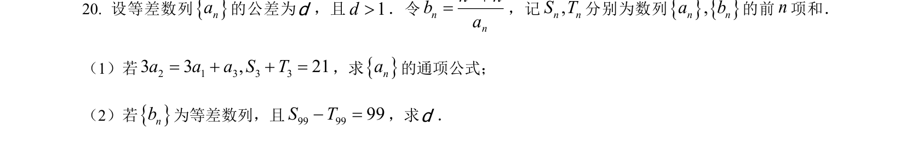
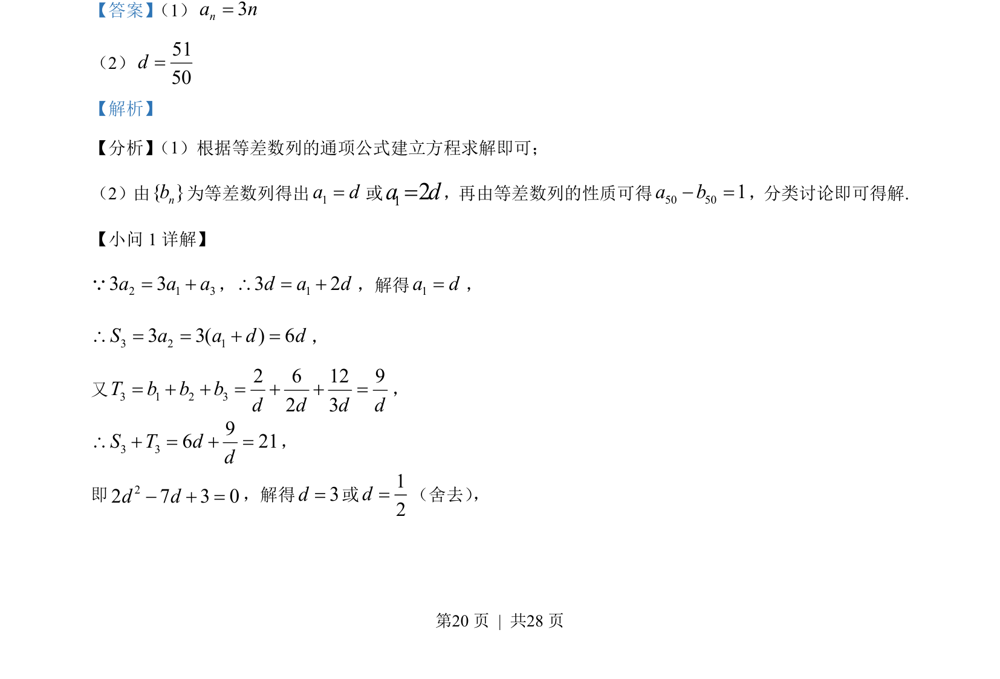
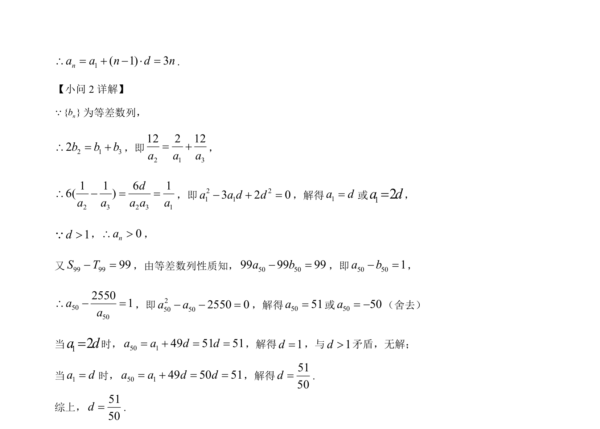

## 题面

## 摘要

考查等差数列通项公式、前n项和及性质，通过建立方程求解参数并分类讨论。

## 关联考点

- [[1063-等差数列通项公式|等差数列通项公式]]
- [[355-等差数列前n项和|等差数列前n项和]]
- [[061-方程|方程求解]]
- [[424-参数分类讨论|分类讨论]]

## 答案与解析

> 📄 原 PDF 第 20 页：`素材/真题/湖南/2008-2024·（湖南）数学高考真题/2023年高考数学试卷（新课标Ⅰ卷）（解析卷）.pdf`

<!-- 题干文本-start -->
## 题干文本
20. 设等差数列na的公差为d，且1d>．令
2nnn nba+=，记,n nS T分别为数列,n na b的前n项和．
（1）若2 1 3 3 33 3 , 21a a a S T= + + =，求na的通项公式；
（2）若nb为等差数列，且99 9999S T- =，求d．
<!-- 题干文本-end -->

<!-- 解析文本-start -->
## 解析文本
【答案】 （1）3na n=    
（2）5150d=
【解析】
【分析】 （1）根据等差数列的通项公式建立方程求解即可；
（2）由{ }nb为等差数列得出1a d=或12a d=， 再由等差数列的性质可得50 501a b- =， 分类讨论即可得解.
【小问 1 详解】
2 1 33 3a a a= +Q， 13 2d a d\ = +，解得1a d=，
3 2 13 3() 6d dS a a=+==\，
又3 1 2 32 6 12 92 3T b b bd d d d= + + = + + =，
3 396 21S T dd\ + = + =，
即22 7 3 0d d- + =，解得3d=或12d=（舍去） ，
<!-- 解析文本-end -->
