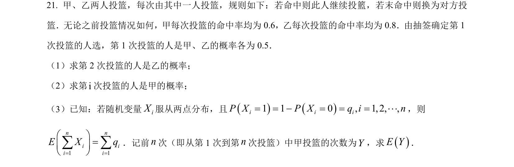
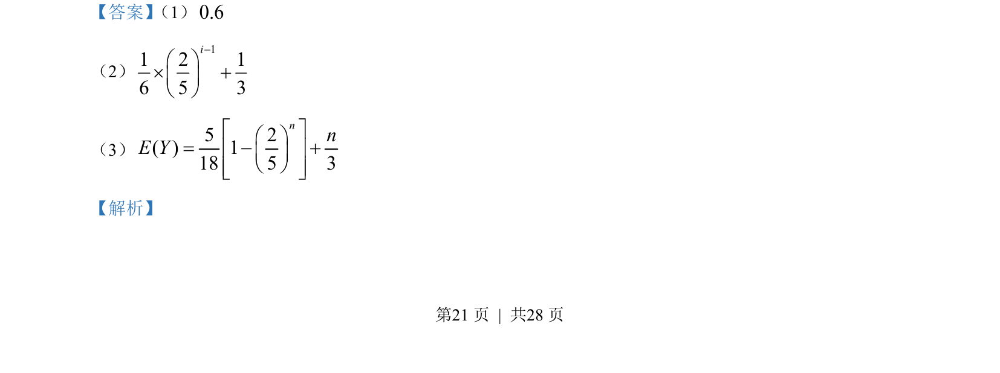
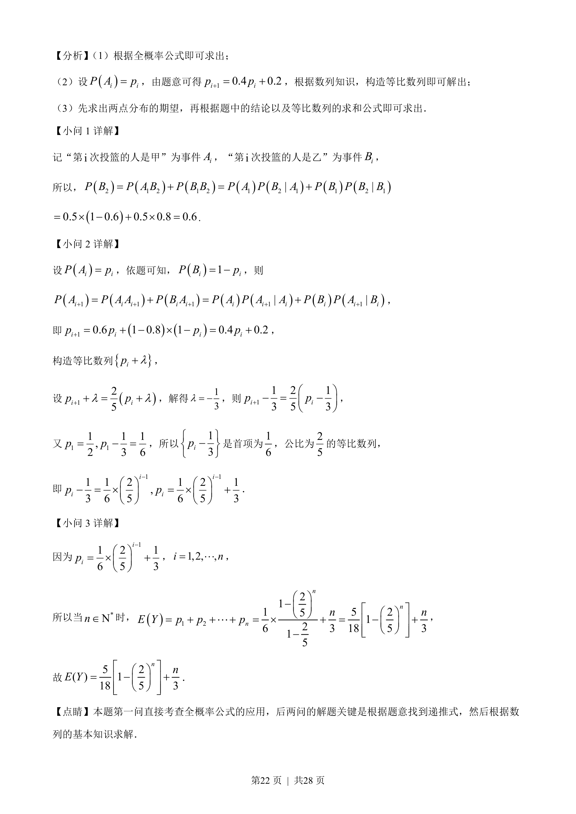

## 题面

## 摘要

该题以投篮为背景，考查全概率公式递推关系、构造等比数列求概率及序列期望。

## 关联考点

- [[320-古典概型|古典概型]]
- [[340-条件概率初步|全概率公式]]
- [[递推数列]]
- [[357-等比数列前n项和|等比数列求和]]

## 答案与解析

> 📄 原 PDF 第 21 页：`素材/真题/湖南/2008-2024·（湖南）数学高考真题/2023年高考数学试卷（新课标Ⅰ卷）（解析卷）.pdf`
