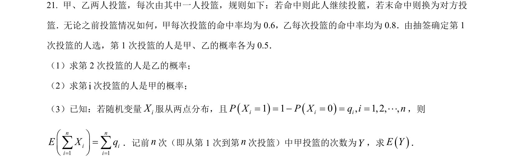
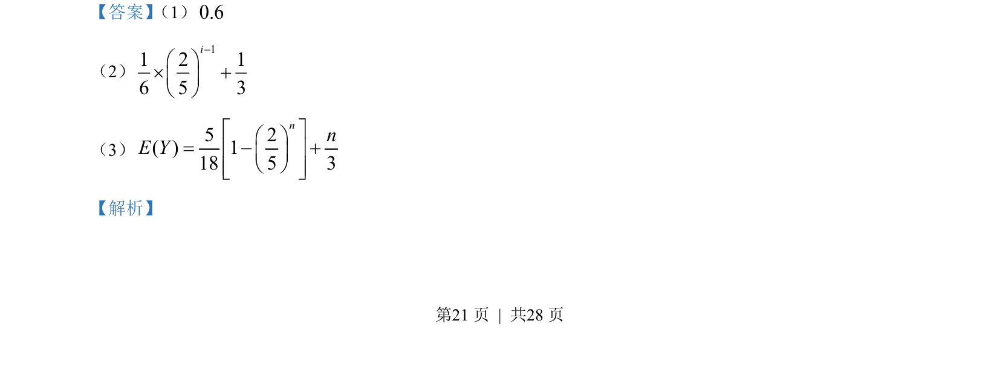
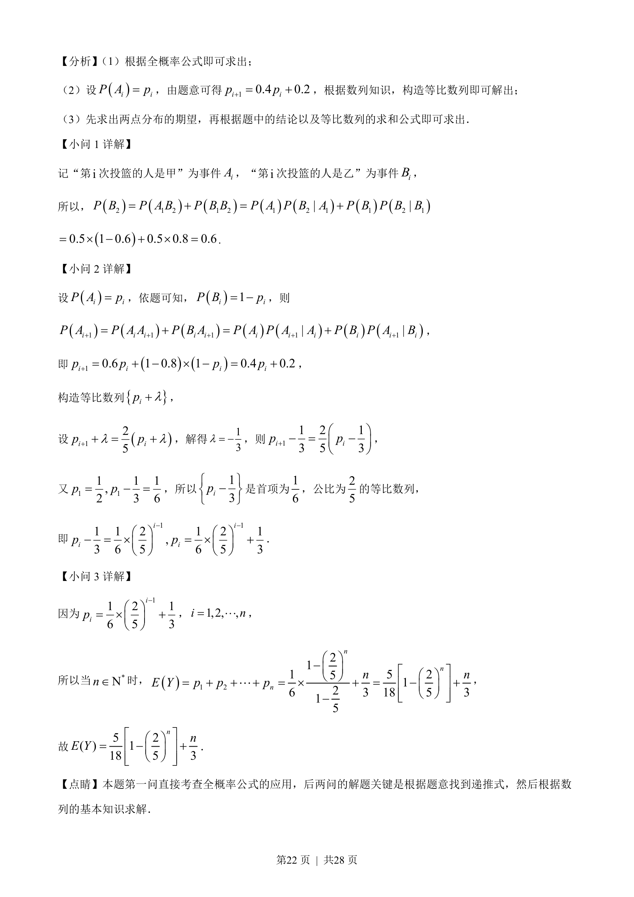

## 题面

## 摘要

该题以投篮为背景，考查全概率公式递推关系、构造等比数列求概率及序列期望。

## 关联考点

- [[320-古典概型|古典概型]]
- [[340-条件概率初步|全概率公式]]
- [[递推数列]]
- [[357-等比数列前n项和|等比数列求和]]

## 答案与解析

> 📄 原 PDF 第 21 页：`素材/真题/湖南/2008-2024·（湖南）数学高考真题/2023年高考数学试卷（新课标Ⅰ卷）（解析卷）.pdf`

<!-- 题干文本-start -->
## 题干文本
21. 甲、乙两人投篮，每次由其中一人投篮，规则如下：若命中则此人继续投籃，若末命中则换为对方投
篮．无论之前投篮情况如何，甲每次投篮的命中率均为0.6，乙每次投篮的命中率均为0.8．由抽签确定第1
次投篮的人选，第 1 次投篮的人是甲、乙的概率各为 0.5．
（1）求第 2 次投篮的人是乙的概率；
（2）求第i次投篮的人是甲的概率；
（3）已知：若随机变量iX服从两点分布，且1 1 0 , 1,2, ,i i iP X P X q i n= = - = = = ×××，则
1 1n ni ii iE X q= =æ ö=ç ÷è øå å．记前n次（即从第 1 次到第n次投篮）中甲投篮的次数为Y，求E Y．
<!-- 题干文本-end -->

<!-- 解析文本-start -->
## 解析文本
【答案】 （1）0.6    
（2）
11 2 16 5 3i-æ ö´ +ç ÷è ø
    
（3）
5 2( ) 118 5 3nnE Yé ùæ ö= - +ê úç ÷è øê úë û
【解析】
<!-- 解析文本-end -->
