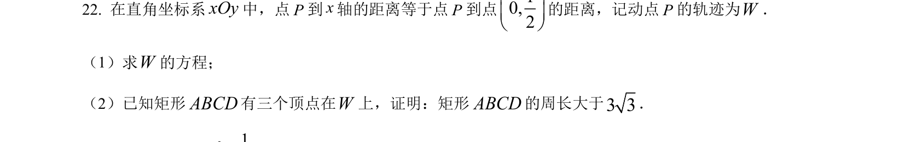
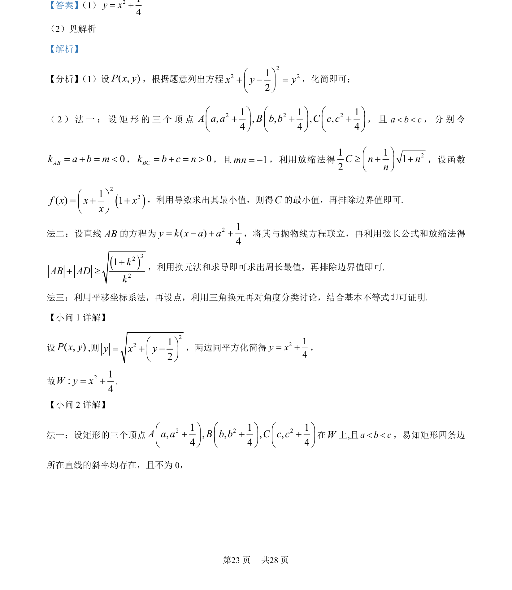
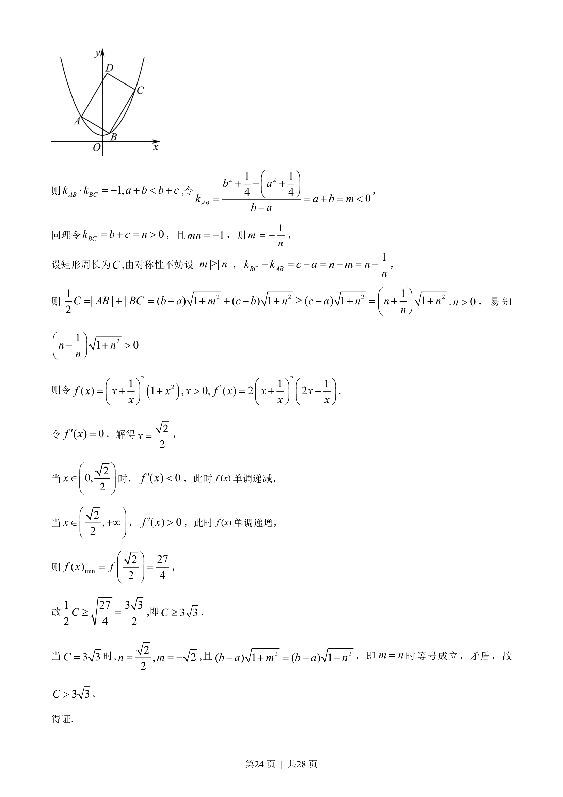
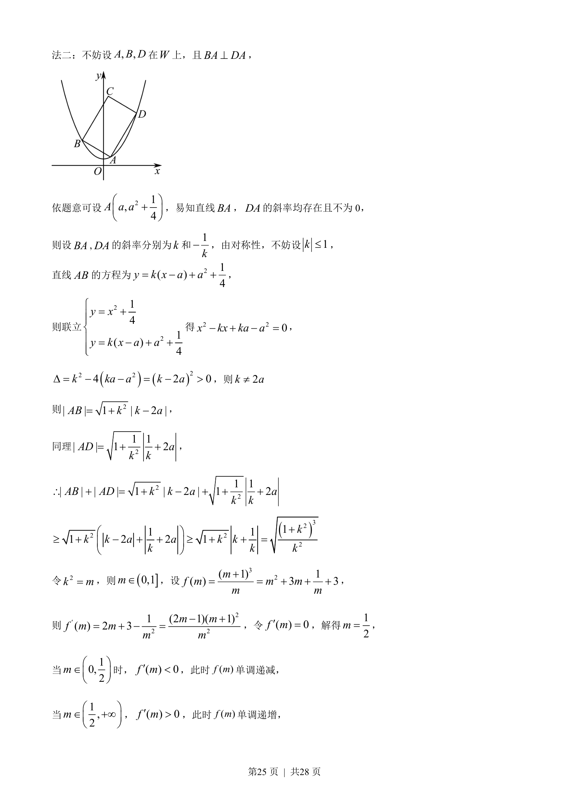
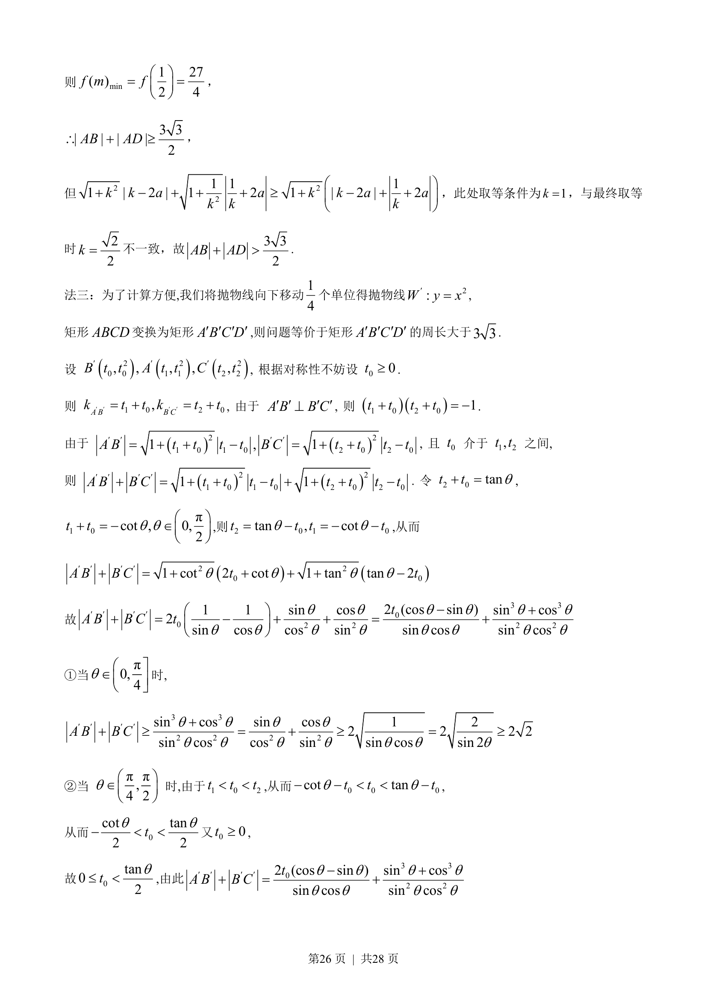
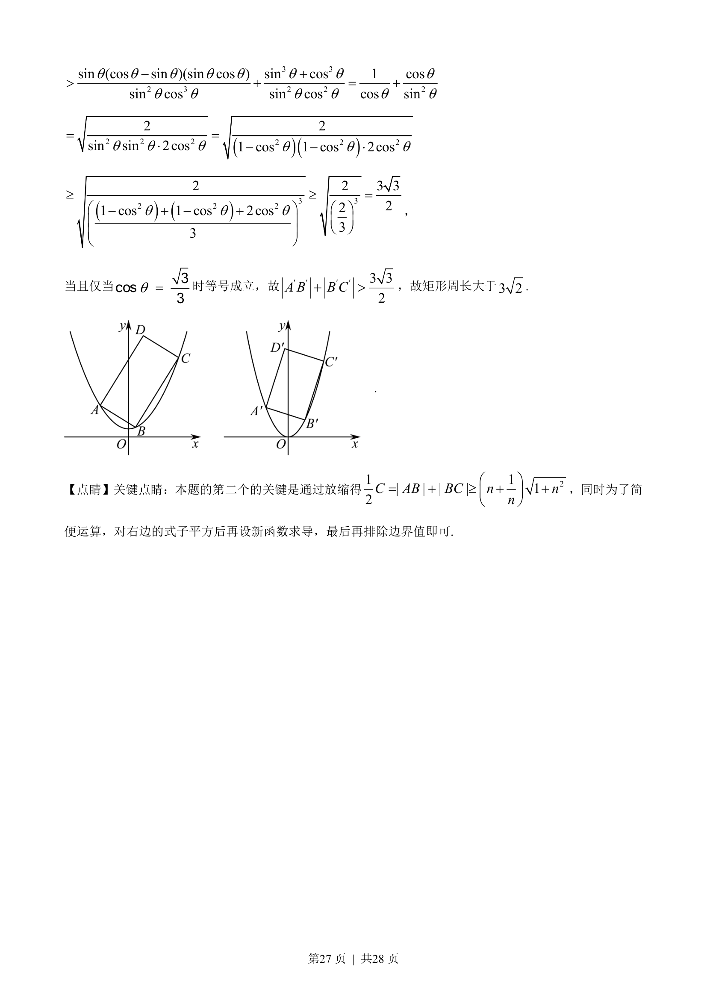

## 题面

## 摘要

求抛物线轨迹方程及矩形顶点在抛物线上的边长最值问题

## 关联考点

- [[376-圆锥曲线轨迹问题|轨迹方程]]
- [[227-抛物线|抛物线]]
- [[840-导数求最值|导数求最值]]
- [[453-数列不等式证明|放缩法]]

## 答案与解析

> 📄 原 PDF 第 23 页：`素材/真题/湖南/2008-2024·（湖南）数学高考真题/2023年高考数学试卷（新课标Ⅰ卷）（解析卷）.pdf`
