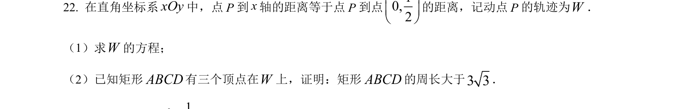
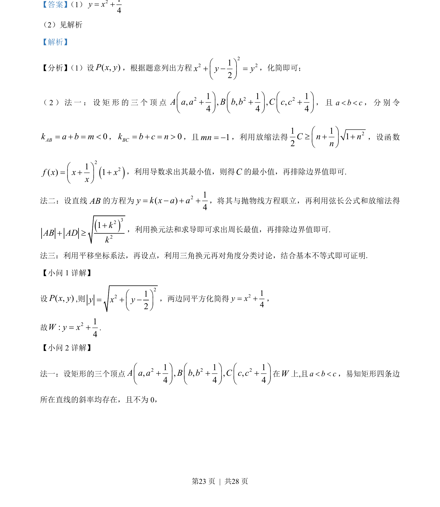
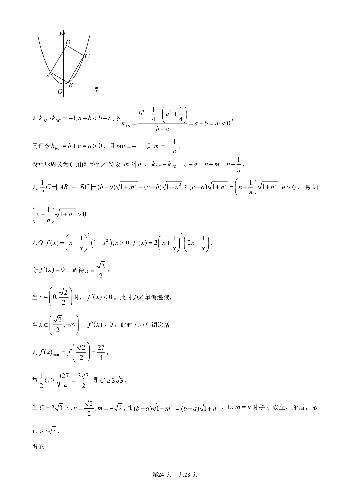
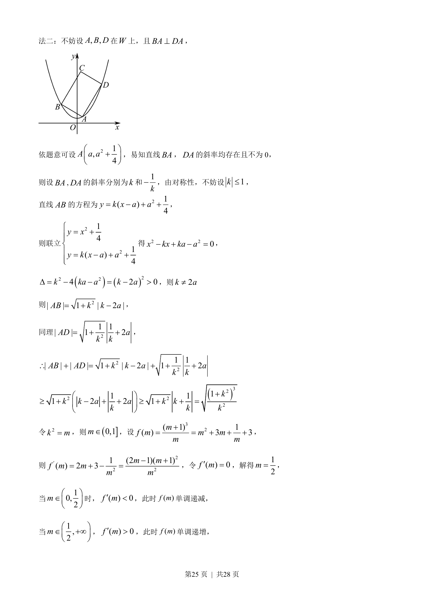
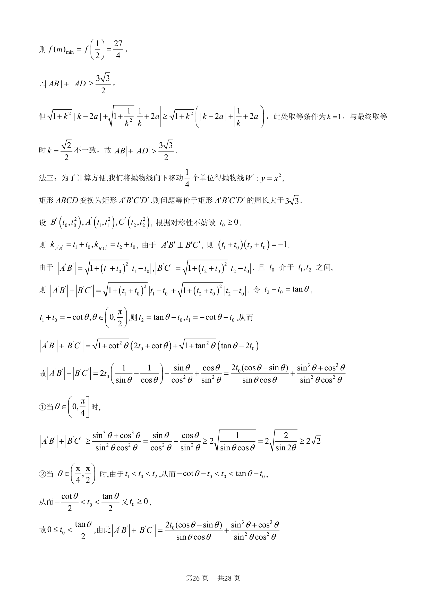
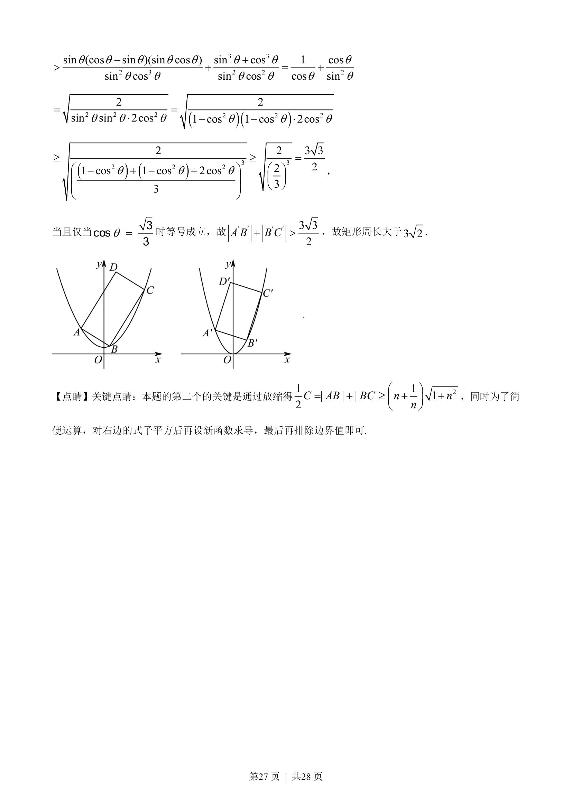
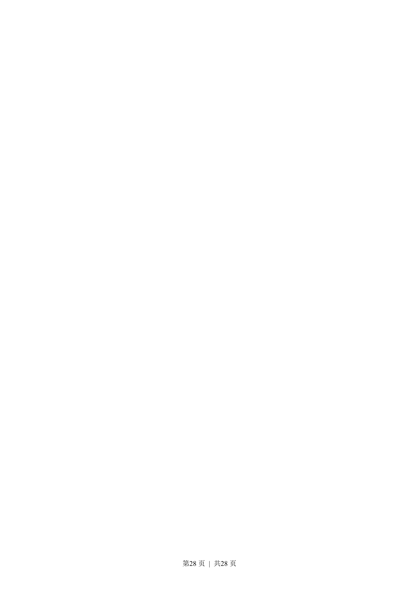

## 题面

## 摘要

求抛物线轨迹方程及矩形顶点在抛物线上的边长最值问题

## 关联考点

- [[376-圆锥曲线轨迹问题|轨迹方程]]
- [[227-抛物线|抛物线]]
- [[840-导数求最值|导数求最值]]
- [[453-数列不等式证明|放缩法]]

## 答案与解析

> 📄 原 PDF 第 23 页：`素材/真题/湖南/2008-2024·（湖南）数学高考真题/2023年高考数学试卷（新课标Ⅰ卷）（解析卷）.pdf`

<!-- 题干文本-start -->
## 题干文本
22. 在直角坐标系xOy中，点P到x轴的距离等于点P到点
10,2æ öç ÷è ø
的距离，记动点P的轨迹为W．
（1）求W的方程；
（2）已知矩形ABCD有三个顶点在W上，证明：矩形ABCD的周长大于33．
<!-- 题干文本-end -->

<!-- 解析文本-start -->
## 解析文本
【答案】 （1）214y x= +    
（2）见解析
【解析】
【分析】 （1）设( , )P x y，根据题意列出方程
22 212x y yæ ö+ - =ç ÷è ø
，化简即可；
（ 2）法一：设矩形的三个顶点 2 2 21 1 1, , , , ,4 4 4A a a B b b C c cæ ö æ ö æ ö+ + +ç ÷ ç ÷ ç ÷è ø è ø è ø
， 且a b c< <， 分 别 令
0ABk a b m=+ = <， 0BCk b c n= + = >，且1mn= -，利用放缩法得 21 112C n nnæ ö³ + +ç ÷è ø
，设函数
221( ) 1f x x xxæ ö= + +ç ÷è ø
，利用导数求出其最小值，则得C的最小值，再排除边界值即可.
法二：设直线AB的方程为 21( )4y k x a a= - + +，将其与抛物线方程联立，再利用弦长公式和放缩法得
3221kAB ADk++ ³，利用换元法和求导即可求出周长最值，再排除边界值即可.
法三：利用平移坐标系法，再设点，利用三角换元再对角度分类讨论，结合基本不等式即可证明.
【小问 1 详解】
设( , )P x y,则
2212y x yæ ö= + -ç ÷è ø
，两边同平方化简得214y x= +，
故 21:4W y x= +.
【小问 2 详解】
法一：设矩形的三个顶点 2 2 21 1 1, , , , ,4 4 4A a a B b b C c cæ ö æ ö æ ö+ + +ç ÷ ç ÷ ç ÷è ø è ø è ø
在W上,且a b c< <，易知矩形四条边
所在直线的斜率均存在，且不为 0，
<!-- 解析文本-end -->
