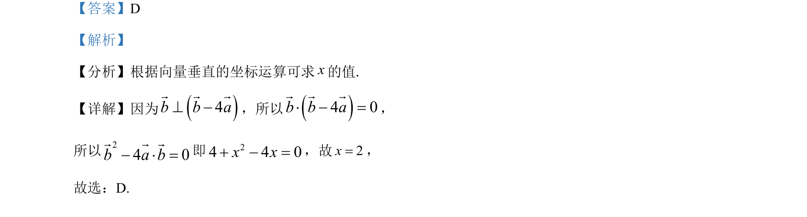

## 题面

## 摘要

本题给出向量垂直条件，通过坐标运算和数量积为零列方程求解未知数x的值。

## 关联考点

- [[1407-向量垂直的坐标表示|向量垂直的坐标表示]]
- [[数量积的坐标运算]]

## 答案与解析

> 📄 原 PDF 第 2 页：`素材/真题/湖南/2008-2024·（湖南）数学高考真题/2024年高考数学试卷（新课标Ⅰ卷）（解析卷）.pdf`

<!-- 题干文本-start -->
## 题干文本
3. 已知向量(0,1), (2, )a b x= =rr，若( 4 )b b a^ -r rr，则x=（    ）
A. 2-B. 1-C. 1 D. 2
<!-- 题干文本-end -->

<!-- 解析文本-start -->
## 解析文本
【答案】D
【解析】
【分析】根据向量垂直的坐标运算可求x的值.
【详解】因为()4b b a^ -r r r
，所以()4 0b b a× - =r r r
，
所以24 0b a b- × =r r r即24 4 0x x+ - =，故2x=，
故选：D.
<!-- 解析文本-end -->
