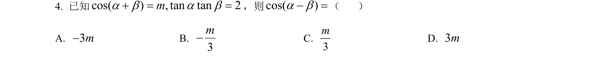
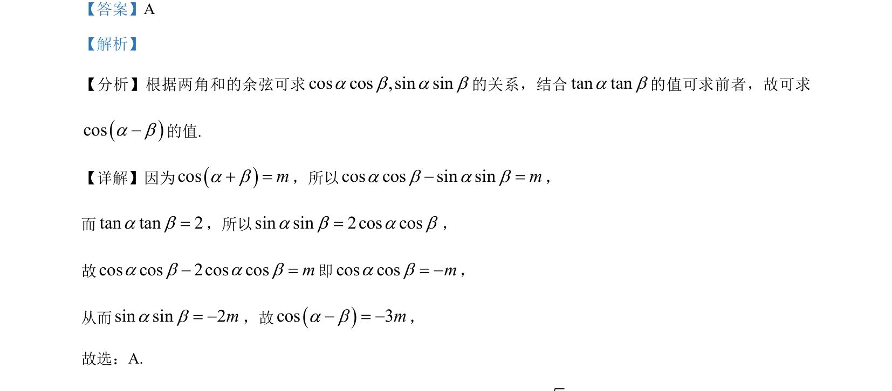

## 题面

## 摘要

根据两角和的余弦公式及已知条件求cos(a-b)的值。

## 关联考点

- [[633-两角和的余弦公式|两角和的余弦公式]]
- [[293-同角三角函数关系|同角三角函数关系]]
- [[整体代换]]

## 答案与解析

> 📄 原 PDF 第 2 页：`素材/真题/湖南/2008-2024·（湖南）数学高考真题/2024年高考数学试卷（新课标Ⅰ卷）（解析卷）.pdf`
