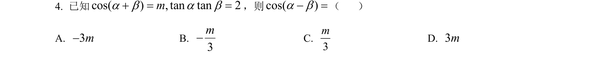
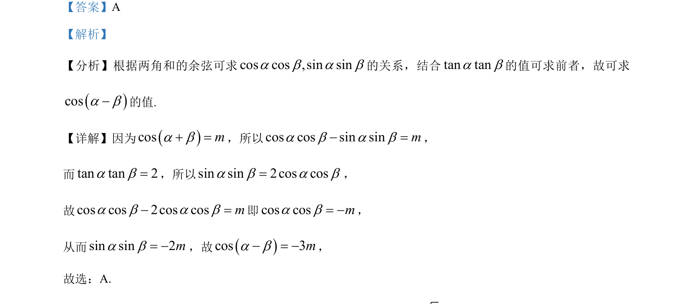

## 题面

## 摘要

根据两角和的余弦公式及已知条件求cos(a-b)的值。

## 关联考点

- [[633-两角和的余弦公式|两角和的余弦公式]]
- [[293-同角三角函数关系|同角三角函数关系]]
- [[整体代换]]

## 答案与解析

> 📄 原 PDF 第 2 页：`素材/真题/湖南/2008-2024·（湖南）数学高考真题/2024年高考数学试卷（新课标Ⅰ卷）（解析卷）.pdf`

<!-- 题干文本-start -->
## 题干文本
4. 已知cos( ) , tan tan 2ma b a b+ = =，则cos( )a b- =（    ）
A. 3m-B. 
3m-C. 
3mD. 3m
<!-- 题干文本-end -->

<!-- 解析文本-start -->
## 解析文本
【答案】A
【解析】
【分析】根据两角和的余弦可求cos cos ,sin sina b a b的关系，结合tan tana b的值可求前者，故可求
cosa b-的值.
【详解】因为cosma b+ =，所以cos cos sin sinma b a b- =，
而tan tan 2a b=，所以sin sin 2cos cosa b a b=，
故cos cos 2cos cosma b a b- =即cos cosma b= -，
从而sin sin 2ma b= -，故cos 3ma b- = -，
故选：A.
<!-- 解析文本-end -->
