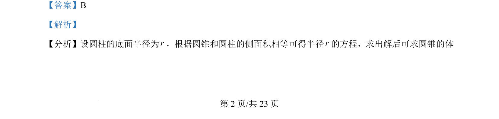
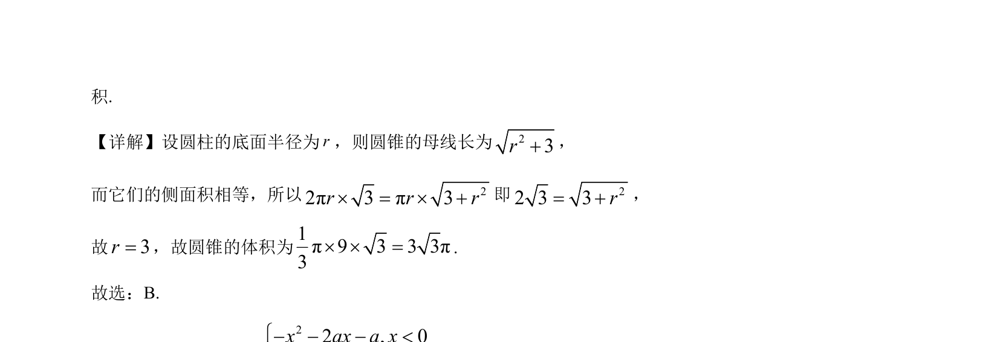

## 题面

## 摘要

圆柱与圆锥侧面积相等，通过方程求圆柱底面半径，进而计算圆锥体积。

## 关联考点

- [[圆柱侧面积]]
- [[783-圆锥侧面积|圆锥侧面积]]
- [[079-圆锥|圆锥体积]]
- [[061-方程|方程求解]]

## 答案与解析

> 📄 原 PDF 第 2 页：`素材/真题/湖南/2008-2024·（湖南）数学高考真题/2024年高考数学试卷（新课标Ⅰ卷）（解析卷）.pdf`
