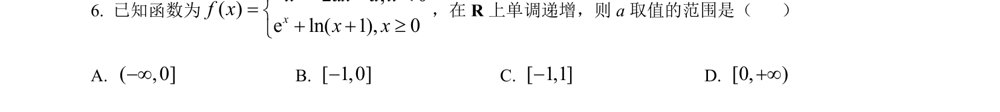
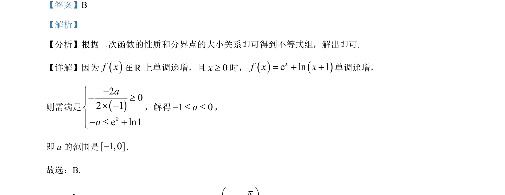

## 题面

## 摘要

考查分段函数单调性求参数范围，需结合二次函数对称轴及分界点函数值比较列不等式组。

## 关联考点

- [[分段函数单调性]]
- [[211-二次函数图象与性质|二次函数性质]]
- [[1108-解不等式|解不等式]]
- [[指数对数比较]]

## 答案与解析

> 📄 原 PDF 第 3 页：`素材/真题/湖南/2008-2024·（湖南）数学高考真题/2024年高考数学试卷（新课标Ⅰ卷）（解析卷）.pdf`
