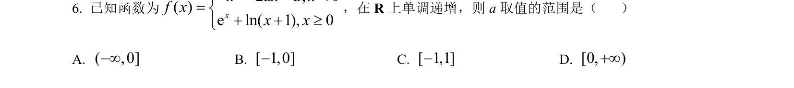
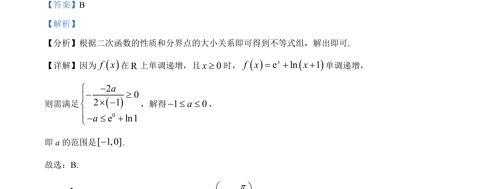

## 题面

## 摘要

考查分段函数单调性求参数范围，需结合二次函数对称轴及分界点函数值比较列不等式组。

## 关联考点

- [[分段函数单调性]]
- [[211-二次函数图象与性质|二次函数性质]]
- [[1108-解不等式|解不等式]]
- [[指数对数比较]]

## 答案与解析

> 📄 原 PDF 第 3 页：`素材/真题/湖南/2008-2024·（湖南）数学高考真题/2024年高考数学试卷（新课标Ⅰ卷）（解析卷）.pdf`

<!-- 题干文本-start -->
## 题干文本
6. 已知函数为
22 , 0( )e ln( 1), 0xx ax a xf xx xì- - - <=í+ + ³î
，在 R 上单调递增，则 a 取值的范围是（    ）
A. ( ,0]-¥B. [ 1,0]-C. [ 1,1]-D. [0, )+¥
<!-- 题干文本-end -->

<!-- 解析文本-start -->
## 解析文本
【答案】B
【解析】
【分析】根据二次函数的性质和分界点的大小关系即可得到不等式组，解出即可.
【详解】因为()f x在R上单调递增，且0x³时，()()e ln 1xf x x= + +单调递增，
则需满足()0202 1e ln1aa-ì- ³ï´ -íï- £ +î
，解得1 0a- £ £，
即 a 的范围是[ 1,0]-.
故选：B.
<!-- 解析文本-end -->
