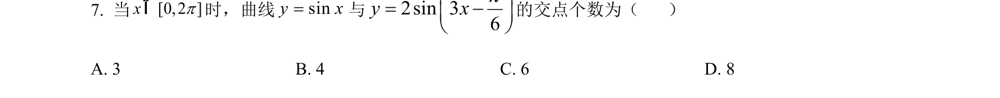
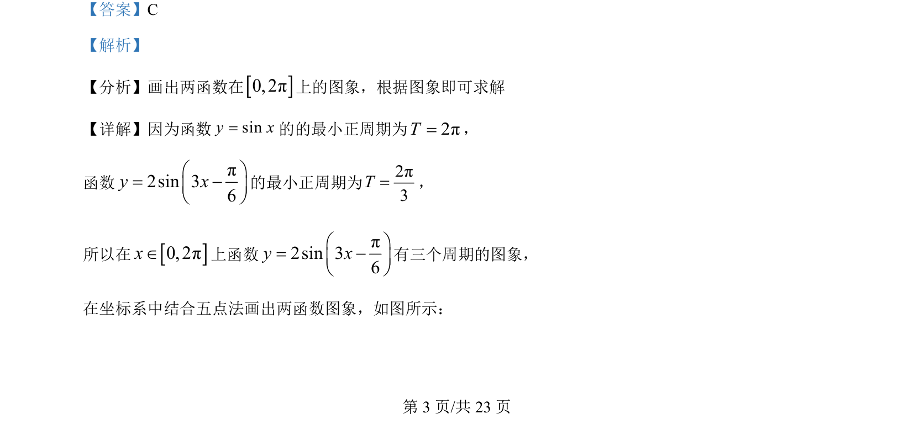
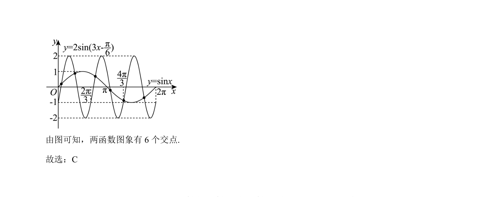

## 题面

## 摘要

考查正弦函数与正弦型函数在给定区间上的图象交点个数，利用周期性作图求解。

## 关联考点

- [[962-正弦函数的图象|正弦函数的图象]]
- [[611-三角函数的周期性|三角函数的周期性]]
- [[函数图象交点]]

## 答案与解析

> 📄 原 PDF 第 3 页：`素材/真题/湖南/2008-2024·（湖南）数学高考真题/2024年高考数学试卷（新课标Ⅰ卷）（解析卷）.pdf`
