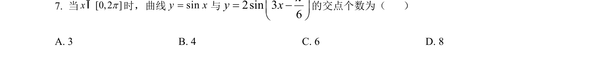
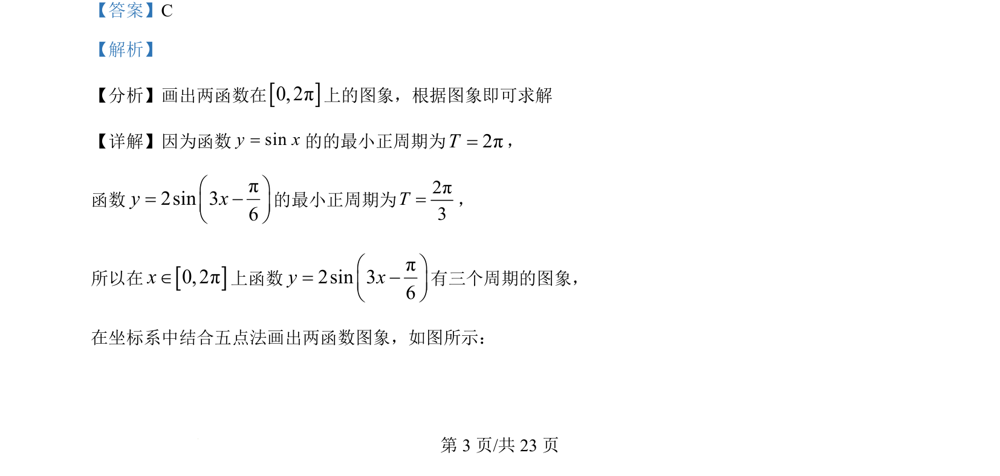
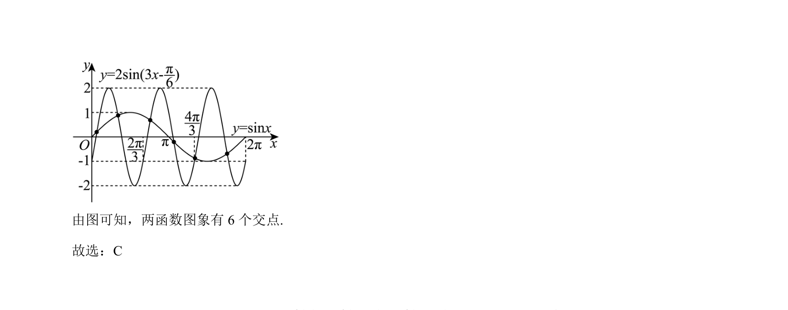

## 题面

## 摘要

考查正弦函数与正弦型函数在给定区间上的图象交点个数，利用周期性作图求解。

## 关联考点

- [[962-正弦函数的图象|正弦函数的图象]]
- [[611-三角函数的周期性|三角函数的周期性]]
- [[函数图象交点]]

## 答案与解析

> 📄 原 PDF 第 3 页：`素材/真题/湖南/2008-2024·（湖南）数学高考真题/2024年高考数学试卷（新课标Ⅰ卷）（解析卷）.pdf`

<!-- 题干文本-start -->
## 题干文本
7. 当[0, 2 ]xpÎ时，曲线siny x=与2sin 36y xpæ ö= -ç ÷è ø
的交点个数为（    ）
A. 3 B. 4 C. 6 D. 8
<!-- 题干文本-end -->

<!-- 解析文本-start -->
## 解析文本
【答案】C
【解析】
【分析】画出两函数在0, 2π上的图象，根据图象即可求解
【详解】因为函数siny x=的的最小正周期为2πT=，
函数 π2sin 36y xæ ö= -ç ÷è ø
的最小正周期为2π3T=，
所以在0, 2πxÎ上函数 π2sin 36y xæ ö= -ç ÷è ø
有三个周期的图象， 
在坐标系中结合五点法画出两函数图象，如图所示：
<!-- 解析文本-end -->
