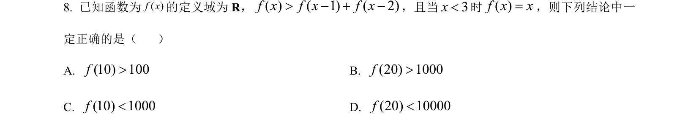
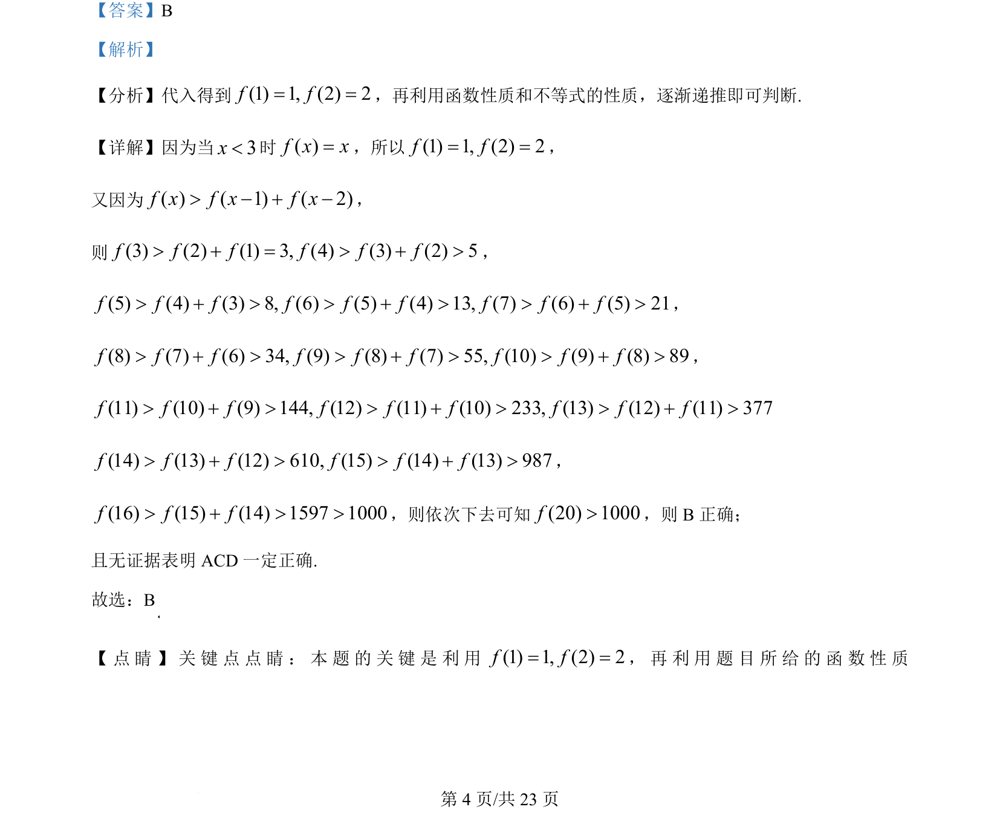
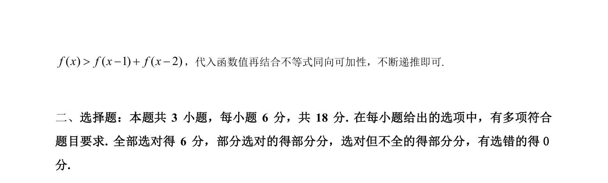

## 题面

## 摘要

本题通过函数递推不等式，利用初始值逐步放缩得到较大自变量处的函数值下界，进而判断选项正误。

## 关联考点

- [[函数递推不等式]]
- [[不等式同向可加性]]
- [[453-数列不等式证明|放缩法]]

## 答案与解析

> 📄 原 PDF 第 4 页：`素材/真题/湖南/2008-2024·（湖南）数学高考真题/2024年高考数学试卷（新课标Ⅰ卷）（解析卷）.pdf`
