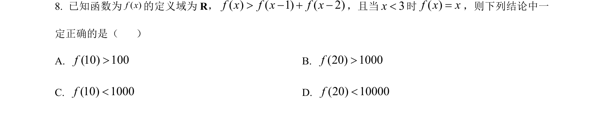
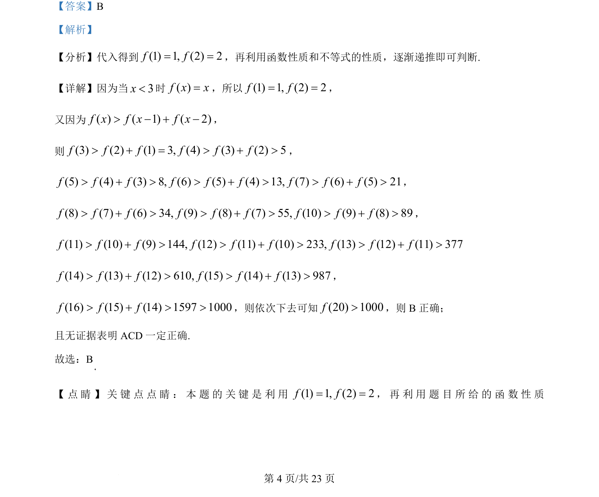
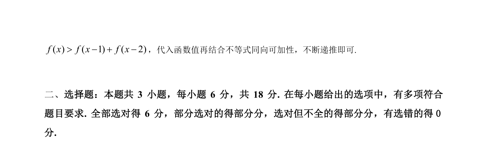

## 题面

## 摘要

本题通过函数递推不等式，利用初始值逐步放缩得到较大自变量处的函数值下界，进而判断选项正误。

## 关联考点

- [[函数递推不等式]]
- [[不等式同向可加性]]
- [[453-数列不等式证明|放缩法]]

## 答案与解析

> 📄 原 PDF 第 4 页：`素材/真题/湖南/2008-2024·（湖南）数学高考真题/2024年高考数学试卷（新课标Ⅰ卷）（解析卷）.pdf`

<!-- 题干文本-start -->
## 题干文本
8. 已知函数为( )f x的定义域为 R，( ) ( 1) ( 2)f x f x f x> - + -，且当3x<时( )f x x=，则下列结论中一
定正确的是（    ）
A. (10) 100f>B. (20) 1000f>
C. (10) 1000f<D. (20) 10000f<
<!-- 题干文本-end -->

<!-- 解析文本-start -->
## 解析文本
【答案】B
【解析】
【分析】代入得到(1) 1, (2) 2f f= =，再利用函数性质和不等式的性质，逐渐递推即可判断.
【详解】因为当3x<时( )f x x=，所以(1) 1, (2) 2f f= =，
又因为( ) ( 1) ( 2)f x f x f x> - + -，
则(3) (2) (1) 3, (4) (3) (2) 5f f f f f f> + = > + >，
(5) (4) (3) 8, (6) (5) (4) 13, (7) (6) (5) 21f f f f f f f f f> + > > + > > + >，
(8) (7) (6) 34, (9) (8) (7) 55, (10) (9) (8) 89f f f f f f f f f> + > > + > > + >，
(11) (10) (9) 144, (12) (11) (10) 233, (13) (12) (11) 377f f f f f f f f f> + > > + > > + >(14) (13) (12) 610, (15) (14) (13) 987f f f f f f> + > > + >，
(16) (15) (14) 1597 1000f f f> + > >，则依次下去可知(20) 1000f>，则 B正确；
且无证据表明 ACD 一定正确.
故选：B
【 点 睛 】 关 键 点 点 睛 ： 本 题 的 关 键 是 利 用(1) 1, (2) 2f f= =， 再 利 用 题 目 所 给 的 函 数 性 质
.
<!-- 解析文本-end -->
