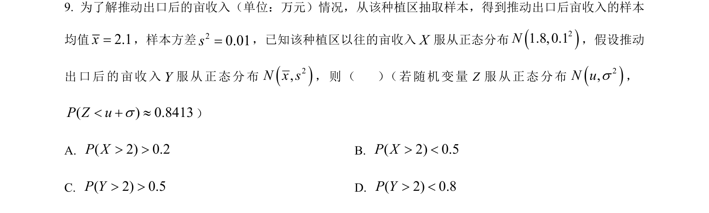
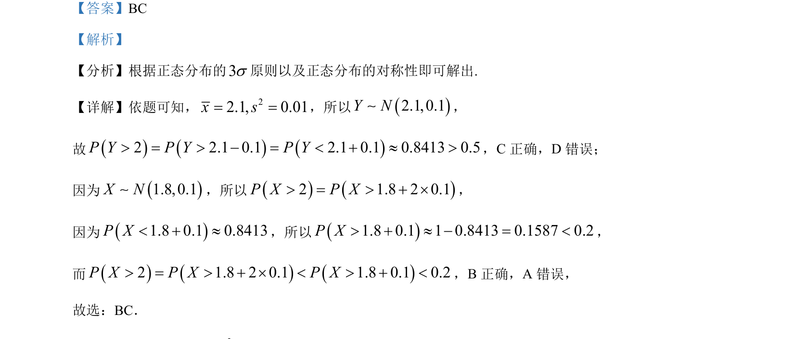

## 题面

## 摘要

考查正态分布的概率计算，利用3σ原则与对称性判断相关概率值。

## 关联考点

- [[496-正态分布概念|正态分布]]
- [[1402-3σ原则|3σ原则]]
- [[948-概率计算|概率计算]]

## 答案与解析

> 📄 原 PDF 第 5 页：`素材/真题/湖南/2008-2024·（湖南）数学高考真题/2024年高考数学试卷（新课标Ⅰ卷）（解析卷）.pdf`
