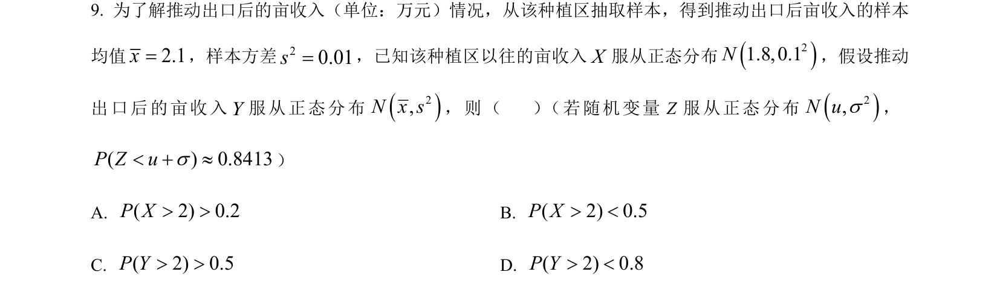
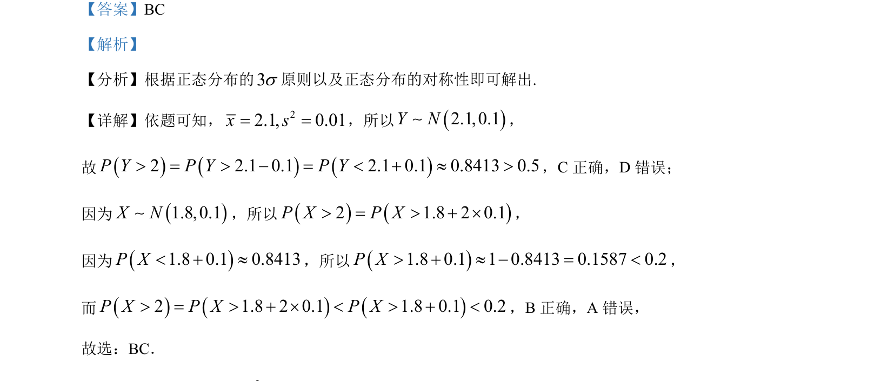

## 题面

## 摘要

考查正态分布的概率计算，利用3σ原则与对称性判断相关概率值。

## 关联考点

- [[496-正态分布概念|正态分布]]
- [[1402-3σ原则|3σ原则]]
- [[948-概率计算|概率计算]]

## 答案与解析

> 📄 原 PDF 第 5 页：`素材/真题/湖南/2008-2024·（湖南）数学高考真题/2024年高考数学试卷（新课标Ⅰ卷）（解析卷）.pdf`

<!-- 题干文本-start -->
## 题干文本
9. 为了解推动出口后的亩收入（单位：万元）情况，从该种植区抽取样本，得到推动出口后亩收入的样本
均值2.1x=，样本方差20.01s=，已知该种植区以往的亩收入X服从正态分布()21.8,0.1N，假设推动
出 口 后 的 亩 收 入Y服 从 正 态 分 布()2,N x s， 则 （    ） （若随机变量Z 服从正态分布()2,N us，
()0.8413PZus<+≈）
A. (2)0.2PX>>B. (2)0.5PX><
C. (2)0.5PY>>D. (2)0.8PY><
<!-- 题干文本-end -->

<!-- 解析文本-start -->
## 解析文本
【答案】BC
【解析】
【分析】根据正态分布的3s原则以及正态分布的对称性即可解出.
【详解】依题可知， 22.1, 0.01x s= =，所以()2.1,0.1Y N:，
故()()()2 2.1 0.1 2.1 0.1 0.8413 0.5P Y P Y P Y> = > - = < + ≈ >，C正确，D 错误；
因为()1.8,0.1X N:，所以()()2 1.8 2 0.1P X P X> = > + ´，
因为()1.8 0.1 0.8413P X< + ≈，所以()1.8 0.1 1 0.8413 0.1587 0.2P X> + ≈ - = <，
而()()()2 1.8 2 0.1 1.8 0.1 0.2P X P X P X> = > + ´ < > + <，B正确，A 错误，
故选：BC．
<!-- 解析文本-end -->
