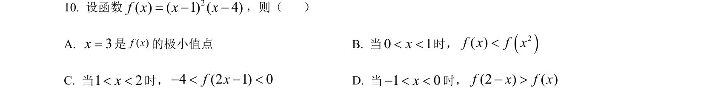
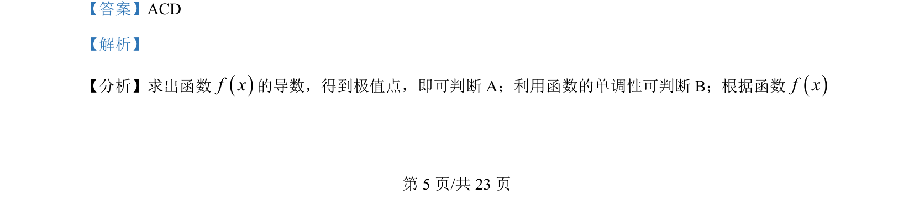
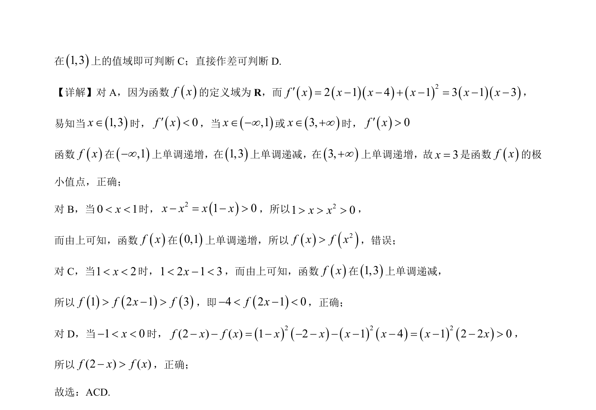

## 题面

## 摘要

该题考查利用导数研究函数的单调性、极值点，并利用单调性比较函数值大小。

## 关联考点

- [[705-利用导数研究函数的单调性|导数与单调性]]
- [[1173-极值点|极值点]]
- [[函数值比较]]
- [[不等式判断]]

## 答案与解析

> 📄 原 PDF 第 5 页：`素材/真题/湖南/2008-2024·（湖南）数学高考真题/2024年高考数学试卷（新课标Ⅰ卷）（解析卷）.pdf`
