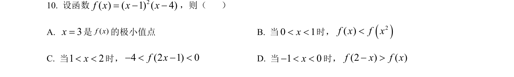
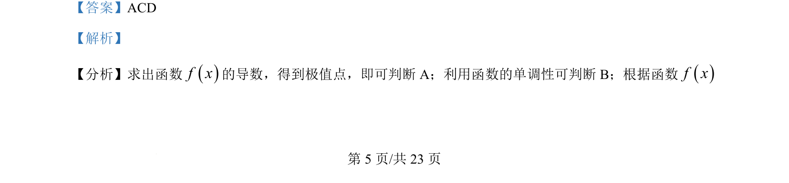
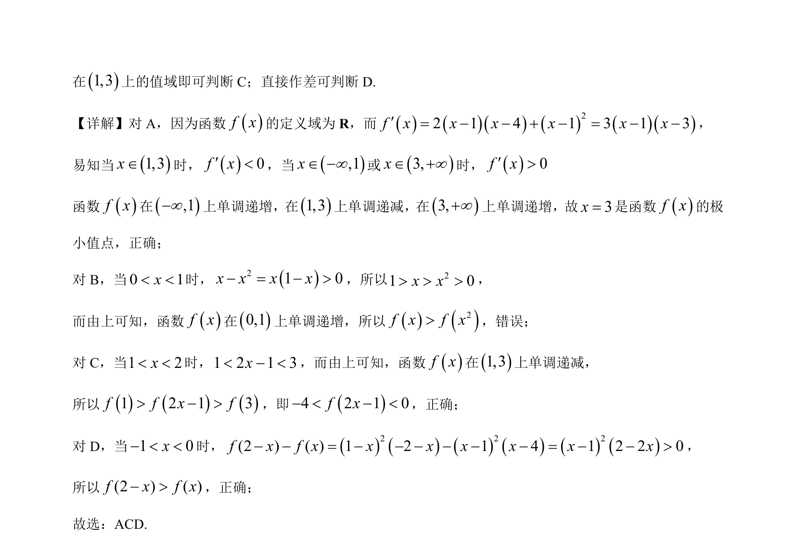

## 题面

## 摘要

该题考查利用导数研究函数的单调性、极值点，并利用单调性比较函数值大小。

## 关联考点

- [[705-利用导数研究函数的单调性|导数与单调性]]
- [[1173-极值点|极值点]]
- [[函数值比较]]
- [[不等式判断]]

## 答案与解析

> 📄 原 PDF 第 5 页：`素材/真题/湖南/2008-2024·（湖南）数学高考真题/2024年高考数学试卷（新课标Ⅰ卷）（解析卷）.pdf`

<!-- 题干文本-start -->
## 题干文本
10. 设函数 2( ) ( 1) ( 4)f x x x= - -，则（    ）
A. 3x=是( )f x的极小值点 B. 当0 1x< <时，2( )f x f x<
C. 当1 2x< <时，4 (2 1) 0f x- < - <D. 当10x-<<时，(2 ) ( )f x f x- >
<!-- 题干文本-end -->

<!-- 解析文本-start -->
## 解析文本
【答案】ACD
【解析】
【分析】求出函数f x的导数，得到极值点，即可判断 A；利用函数的单调性可判断 B；根据函数f x
<!-- 解析文本-end -->
