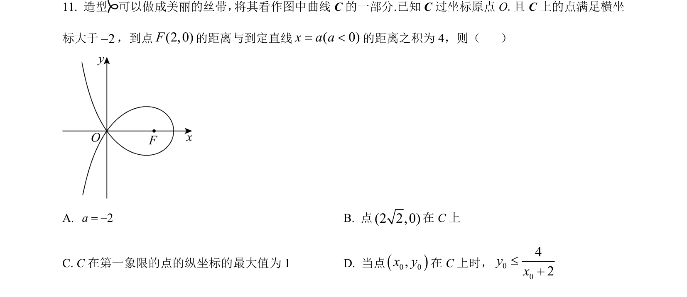
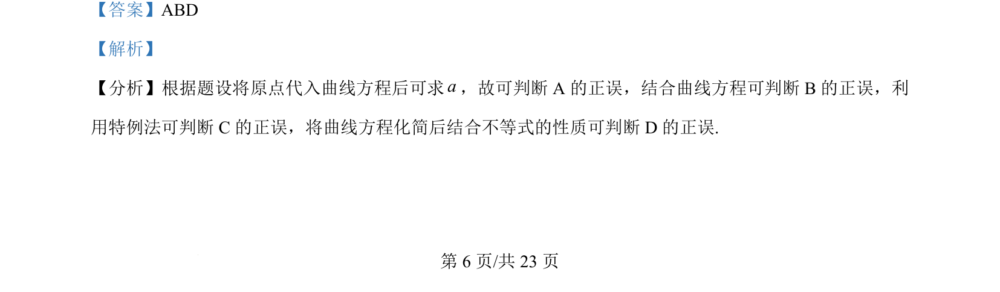
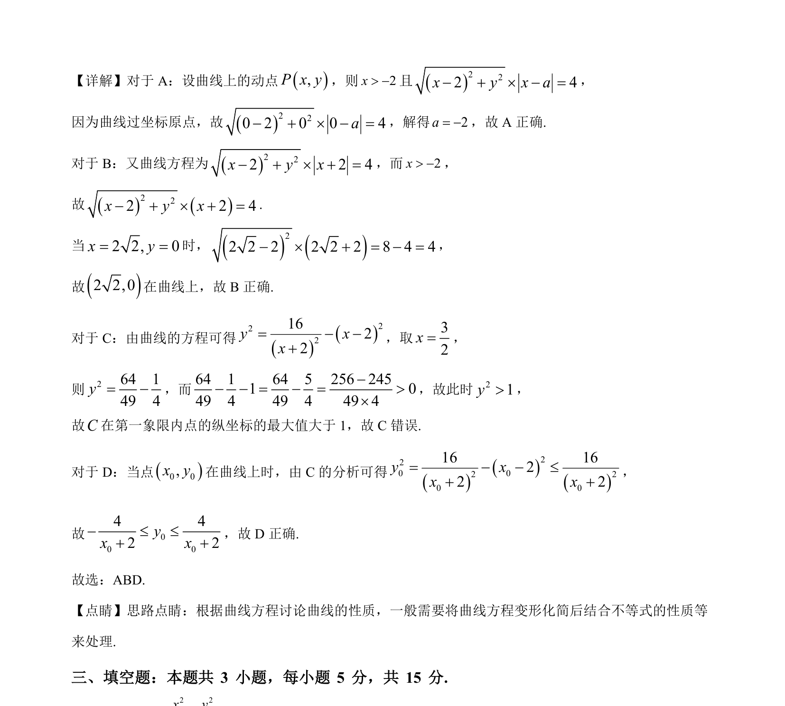

## 题面

## 摘要

判断曲线方程性质，通过代入原点、特例验证及不等式化简分析选项正误

## 关联考点

- [[曲线方程]]
- [[点代入]]
- [[特例法]]
- [[117-不等式性质|不等式性质]]

## 答案与解析

> 📄 原 PDF 第 6 页：`素材/真题/湖南/2008-2024·（湖南）数学高考真题/2024年高考数学试卷（新课标Ⅰ卷）（解析卷）.pdf`

<!-- 题干文本-start -->
## 题干文本
11. 造型 可以做成美丽的丝带， 将其看作图中曲线C的一部分.已知 C过坐标原点 O.且 C上的点满足横坐
标大于2-，到点(2,0)F的距离与到定直线( 0)x a a= <的距离之积为 4，则（    ）
A. 2a= -B. 点(2 2,0)在 C上
C. C在第一象限的点的纵坐标的最大值为 1 D. 当点()0 0,x y在 C上时，0042yx£+
<!-- 题干文本-end -->

<!-- 解析文本-start -->
## 解析文本
【答案】ABD
【解析】
【分析】根据题设将原点代入曲线方程后可求a，故可判断 A 的正误，结合曲线方程可判断 B 的正误，利
用特例法可判断 C的正误，将曲线方程化简后结合不等式的性质可判断 D 的正误.
<!-- 解析文本-end -->
