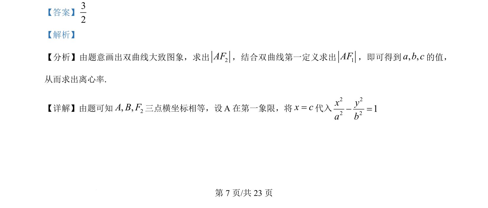
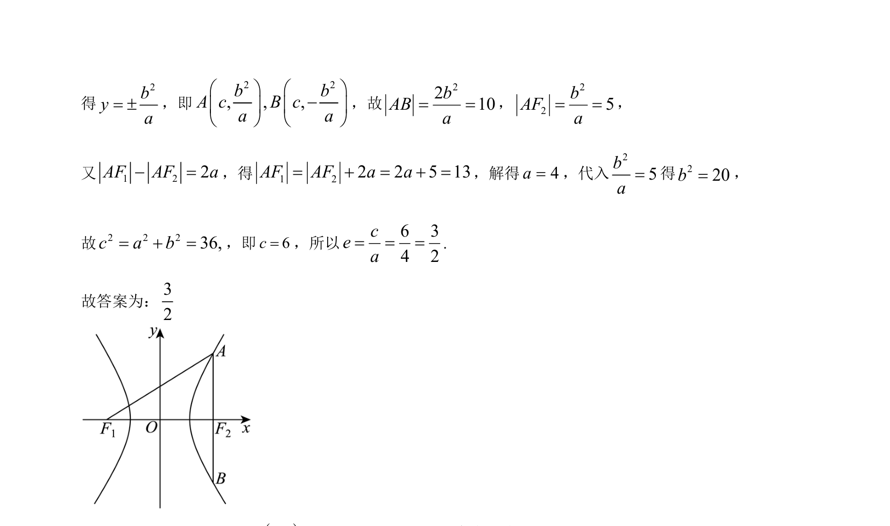

## 题面

## 摘要

双曲线中，通过焦点弦长与定义联立方程求参数，进而计算离心率。

## 关联考点

- [[730-双曲线的定义|双曲线的定义]]
- [[1274-双曲线的几何性质|双曲线的几何性质]]
- [[391-椭圆离心率|离心率]]

## 答案与解析

> 📄 原 PDF 第 7 页：`素材/真题/湖南/2008-2024·（湖南）数学高考真题/2024年高考数学试卷（新课标Ⅰ卷）（解析卷）.pdf`
