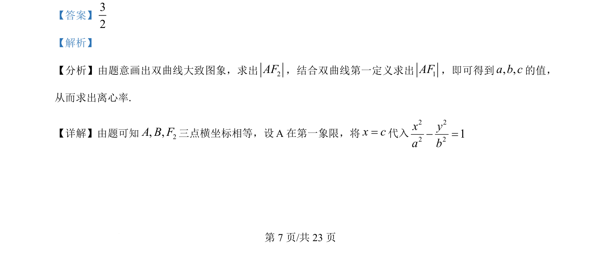
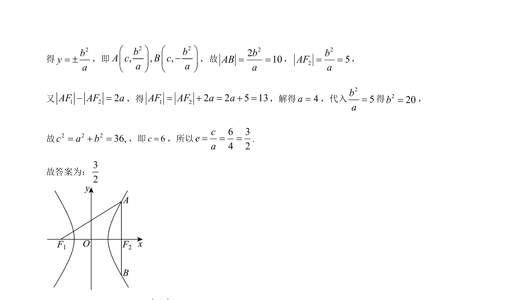

## 题面

## 摘要

双曲线中，通过焦点弦长与定义联立方程求参数，进而计算离心率。

## 关联考点

- [[730-双曲线的定义|双曲线的定义]]
- [[367-双曲线几何性质|双曲线的几何性质]]
- [[391-椭圆离心率|离心率]]

## 答案与解析

> 📄 原 PDF 第 7 页：`素材/真题/湖南/2008-2024·（湖南）数学高考真题/2024年高考数学试卷（新课标Ⅰ卷）（解析卷）.pdf`

<!-- 题干文本-start -->
## 题干文本
12. 设双曲线
2 22 2: 1( 0, 0)x yC a ba b- = > >的左右焦点分别为1 2F F、，过2F作平行于y轴的直线交 C于 A，B
两点，若1||13,||10FAAB==，则 C的离心率为___________．
<!-- 题干文本-end -->

<!-- 解析文本-start -->
## 解析文本
【答案】32
【解析】
【分析】由题意画出双曲线大致图象，求出2AF，结合双曲线第一定义求出1AF，即可得到, ,a b c的值，
从而求出离心率.
【详解】由题可知 2, ,A B F三点横坐标相等，设A在第一象限，将x c=代入
2 22 21x ya b- =
<!-- 解析文本-end -->
