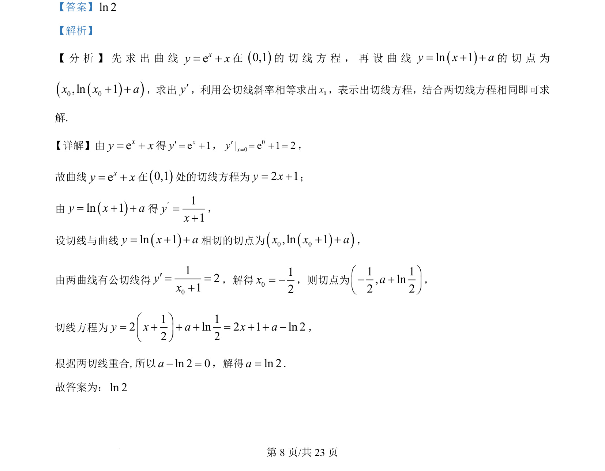

## 题面

## 摘要

求曲线切线方程及两曲线公切线问题，利用导数几何意义建立等式。

## 关联考点

- [[440-导数的几何意义|导数的几何意义]]
- [[422-切线方程|切线方程]]
- [[公切线]]

## 答案与解析

> 📄 原 PDF 第 8 页：`素材/真题/湖南/2008-2024·（湖南）数学高考真题/2024年高考数学试卷（新课标Ⅰ卷）（解析卷）.pdf`

<!-- 题干文本-start -->
## 题干文本
13. 若曲线exy x= +在点()0,1处的切线也是曲线ln( 1)y x a= + +的切线，则=a__________.
<!-- 题干文本-end -->

<!-- 解析文本-start -->
## 解析文本
【答案】ln 2
【解析】
【 分 析 】 先 求 出 曲 线exy x= +在()0,1的 切 线 方 程 ， 再 设 曲 线()ln 1y x a= + +的 切 点 为
()()0 0,ln 1x x a+ +，求出y¢，利用公切线斜率相等求出0x，表示出切线方程，结合两切线方程相同即可求
解.
详解】由exy x= +得e 1xy¢= +， 00| e 1 2xy=¢= + =，
故曲线exy x= +在()0,1处的切线方程为2 1y x= +；
由()ln 1y x a= + +得11yx¢=+
，
设切线与曲线()ln 1y x a= + +相切的切点为()()0 0,ln 1x x a+ +，
由两曲线有公切线得
0121yx¢= =+，解得012x= -，则切点为1 1, ln2 2aæ ö- +ç ÷è ø
，
切线方程为 1 12 ln 2 1 ln 22 2y x a x aæ ö= + + + = + + -ç ÷è ø
，
根据两切线重合,所以ln 2 0a- =，解得ln 2a=.
故答案为：ln 2
【
<!-- 解析文本-end -->
