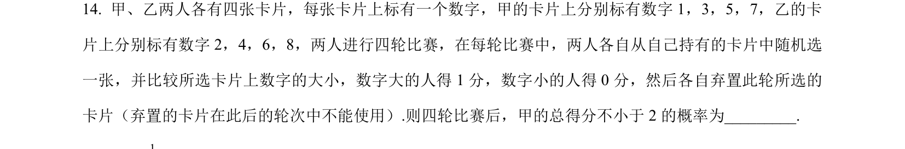
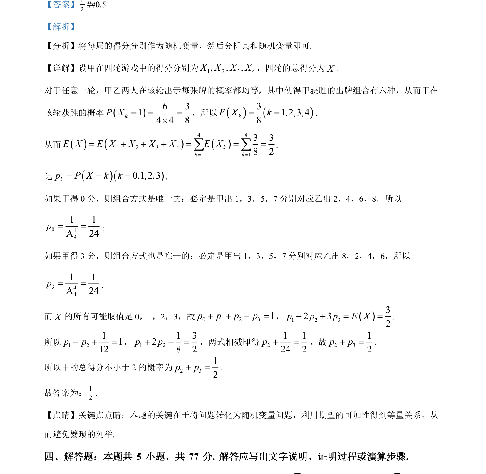

## 题面

## 摘要

考查四轮游戏中得分的随机变量期望和概率分布。

## 关联考点

- [[1133-随机变量|随机变量]]
- [[1039-离散型随机变量的期望|数学期望]]
- [[320-古典概型|古典概型]]

## 答案与解析

> 📄 原 PDF 第 9 页：`素材/真题/湖南/2008-2024·（湖南）数学高考真题/2024年高考数学试卷（新课标Ⅰ卷）（解析卷）.pdf`
