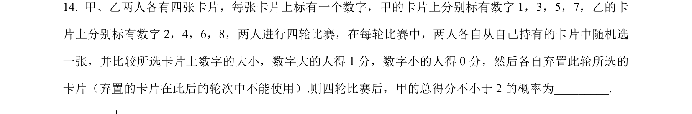
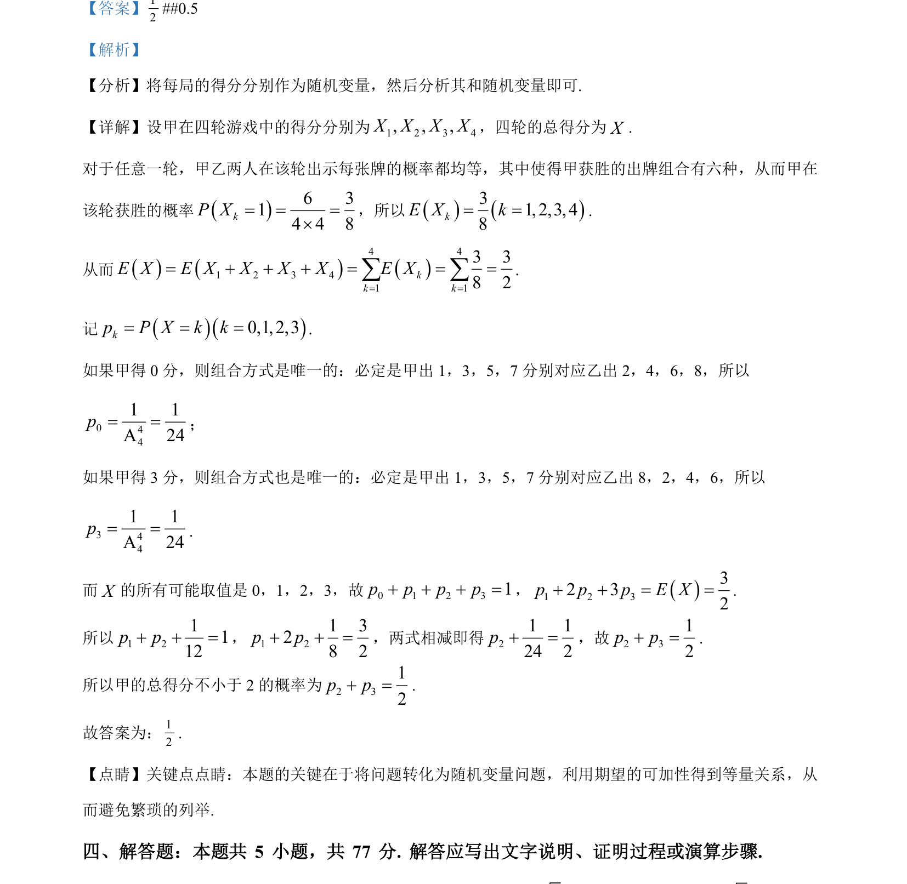

## 题面

## 摘要

考查四轮游戏中得分的随机变量期望和概率分布。

## 关联考点

- [[1133-随机变量|随机变量]]
- [[501-离散型随机变量期望|数学期望]]
- [[320-古典概型|古典概型]]

## 答案与解析

> 📄 原 PDF 第 9 页：`素材/真题/湖南/2008-2024·（湖南）数学高考真题/2024年高考数学试卷（新课标Ⅰ卷）（解析卷）.pdf`

<!-- 题干文本-start -->
## 题干文本
14. 甲、乙两人各有四张卡片，每张卡片上标有一个数字，甲的卡片上分别标有数字 1，3，5，7，乙的卡
片上分别标有数字 2，4，6，8，两人进行四轮比赛，在每轮比赛中，两人各自从自己持有的卡片中随机选
一张，并比较所选卡片上数字的大小，数字大的人得 1 分，数字小的人得 0 分，然后各自弃置此轮所选的
卡片（弃置的卡片在此后的轮次中不能使用）.则四轮比赛后，甲的总得分不小于 2 的概率为_________.
<!-- 题干文本-end -->

<!-- 解析文本-start -->
## 解析文本
【答案】12##0.5
【解析】
【分析】将每局的得分分别作为随机变量，然后分析其和随机变量即可.
【详解】设甲在四轮游戏中的得分分别为1 2 3 4, , ,X X X X，四轮的总得分为X.
对于任意一轮，甲乙两人在该轮出示每张牌的概率都均等，其中使得甲获胜的出牌组合有六种，从而甲在
该轮获胜的概率6 314 4 8kP X= = =´
，所以31, 2,3, 48kE X k= =.
从而4 41 2 3 41 13 38 2kk kE X E X X X X E X= == + + + = = =å å.
记0,1, 2,3kp P X k k= = =.
如果甲得 0 分，则组合方式是唯一的：必定是甲出 1，3，5，7 分别对应乙出 2，4，6，8，所以
0441 1A 24p= =；
如果甲得 3 分，则组合方式也是唯一的：必定是甲出 1，3，5，7 分别对应乙出 8，2，4，6，所以
3441 1A 24p= =.
而X的所有可能取值是 0，1，2，3，故0 1 2 31p p p p+ + + =， 1 2 332 32p p p E X+ + = =.
所以1 21112p p+ + =，1 21 328 2p p+ + =，两式相减即得21 124 2p+ =，故2 312p p+ =.
所以甲的总得分不小于 2 的概率为2 312p p+ =.
故答案为：12.
【点睛】关键点点睛：本题的关键在于将问题转化为随机变量问题，利用期望的可加性得到等量关系，从
而避免繁琐的列举.
四、解答题：本题共 5 小题，共 77 分. 解答应写出文字说明、证明过程或演算步骤.
<!-- 解析文本-end -->
