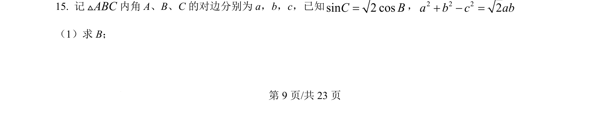
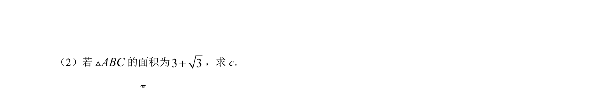
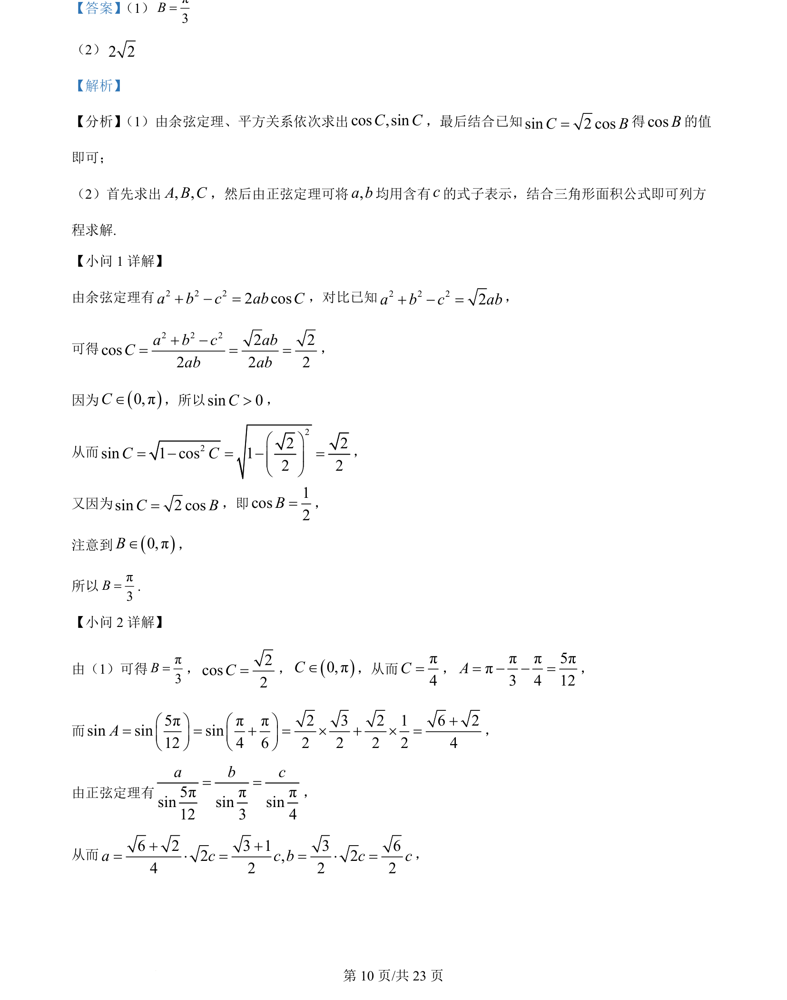
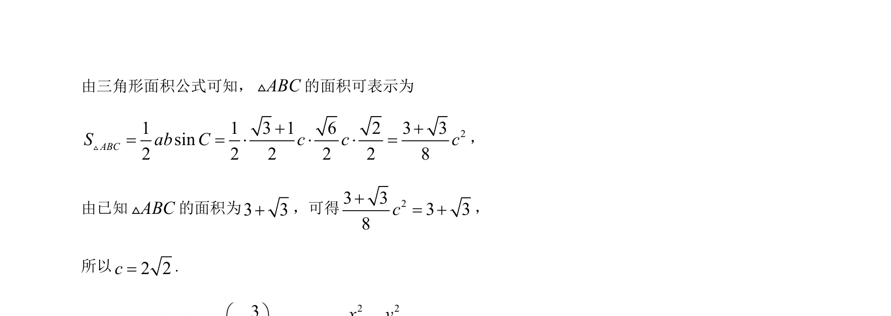

## 题面

## 摘要

本题主要考查利用余弦定理、正弦定理和三角形面积公式解三角形，涉及求角和边的关系。

## 关联考点

- [[126-定理|余弦定理]]
- [[126-定理|正弦定理]]
- [[619-三角形面积公式|三角形面积公式]]
- [[293-同角三角函数关系|同角三角函数关系]]

## 答案与解析

> 📄 原 PDF 第 9 页：`素材/真题/湖南/2008-2024·（湖南）数学高考真题/2024年高考数学试卷（新课标Ⅰ卷）（解析卷）.pdf`
