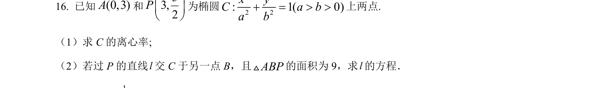
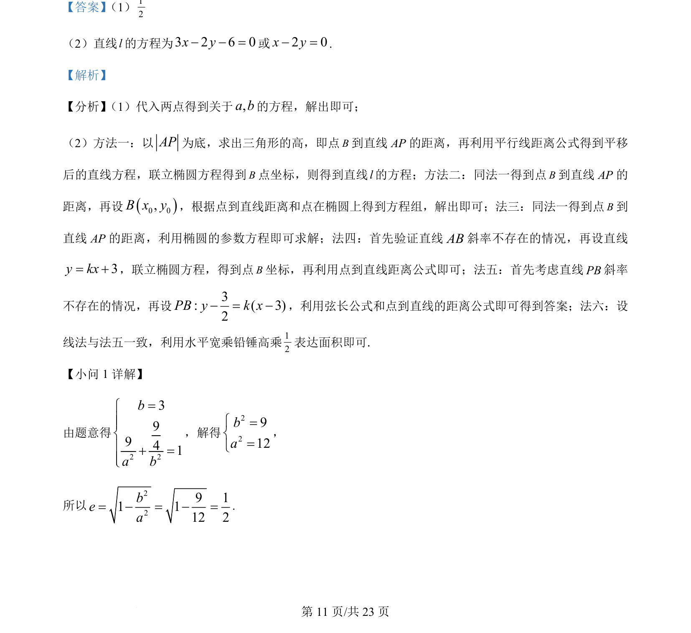
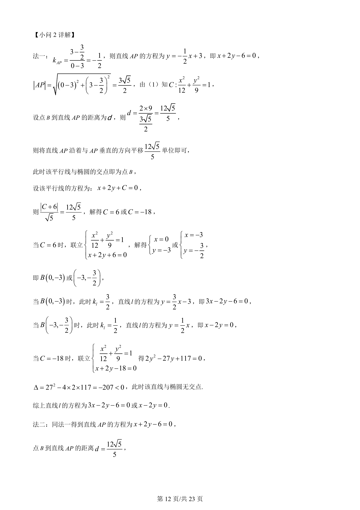
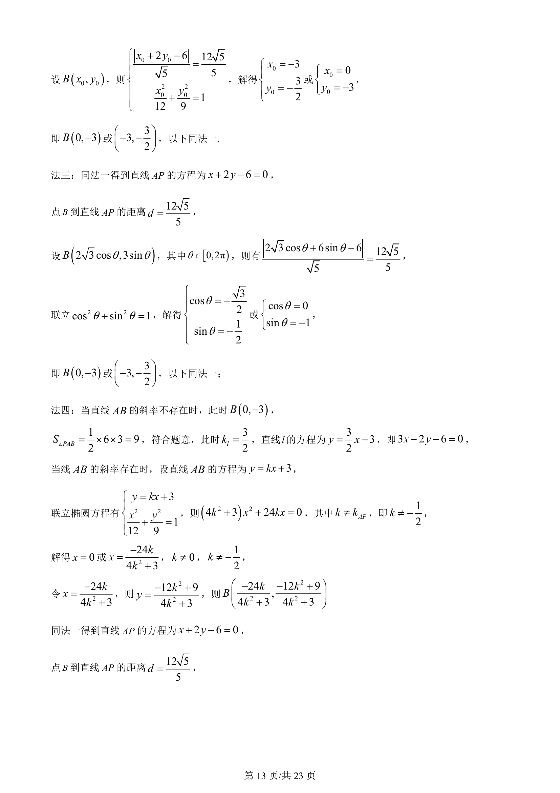
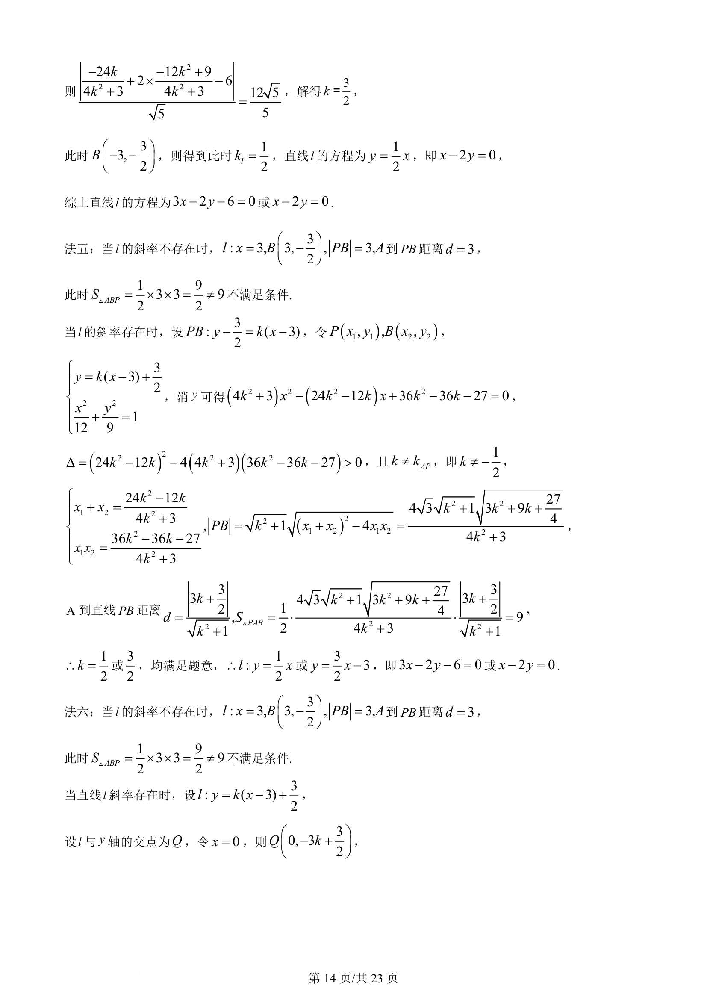
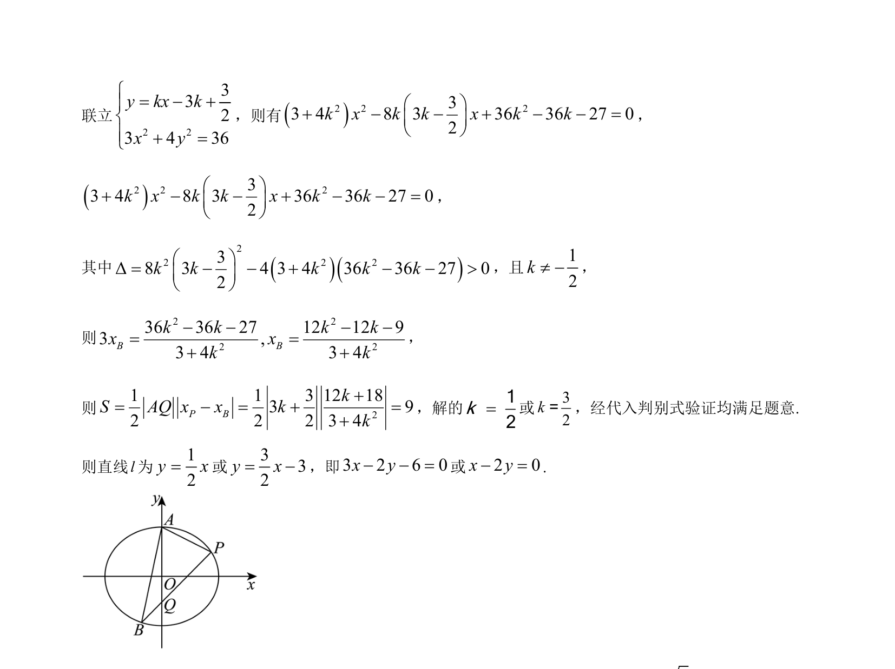

## 题面

## 摘要

椭圆中求离心率和直线方程，综合运用点到直线距离、联立方程等解法。

## 关联考点

- [[061-方程|椭圆的标准方程]]
- [[391-椭圆离心率|离心率]]
- [[980-点到直线的距离|点到直线的距离]]
- [[015-位置|直线与椭圆的位置关系]]

## 答案与解析

> 📄 原 PDF 第 11 页：`素材/真题/湖南/2008-2024·（湖南）数学高考真题/2024年高考数学试卷（新课标Ⅰ卷）（解析卷）.pdf`
