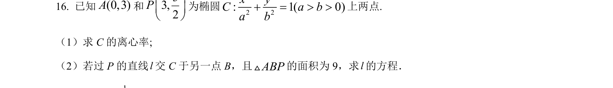
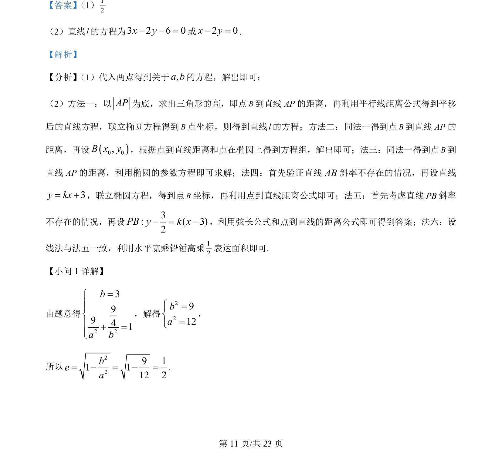
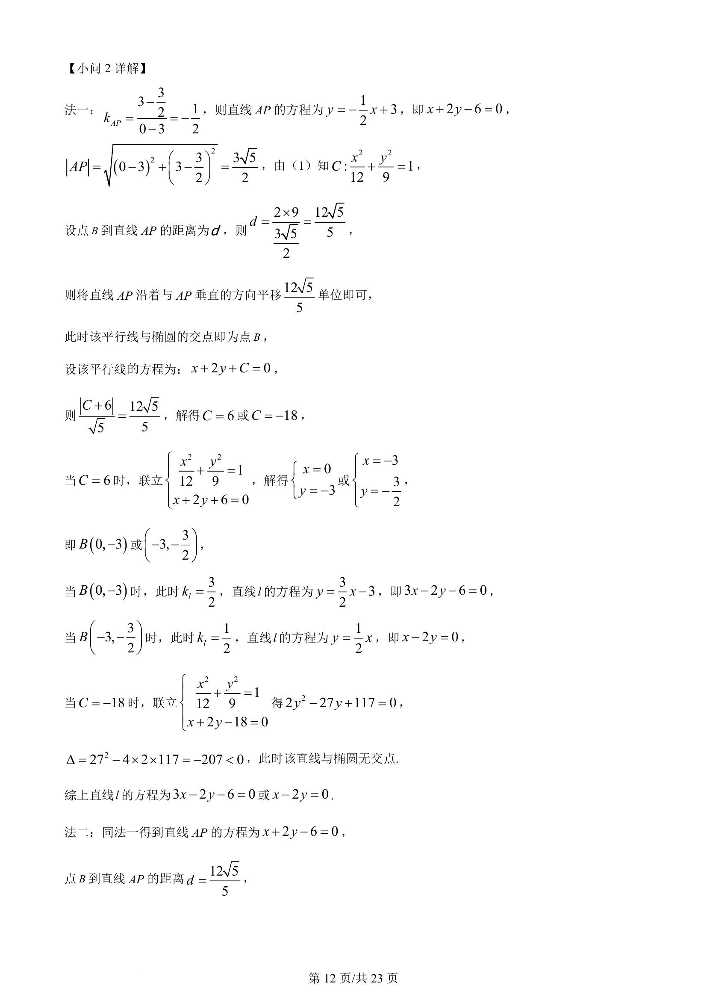
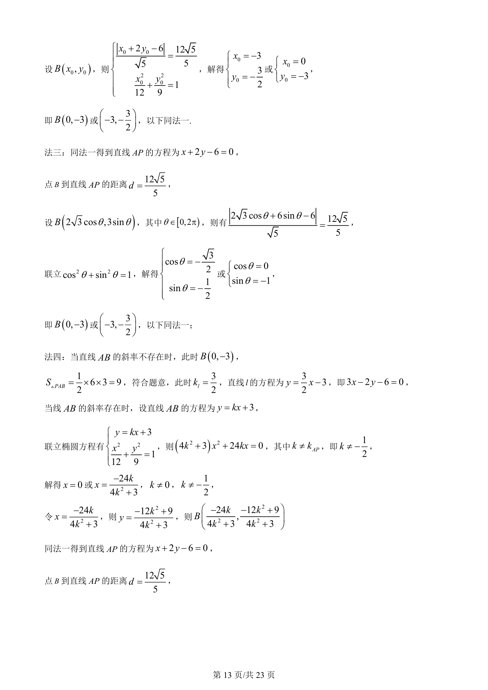
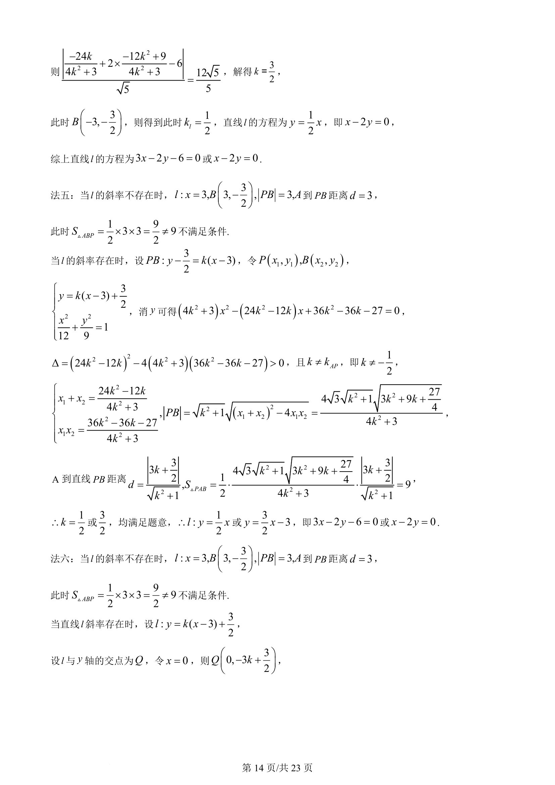
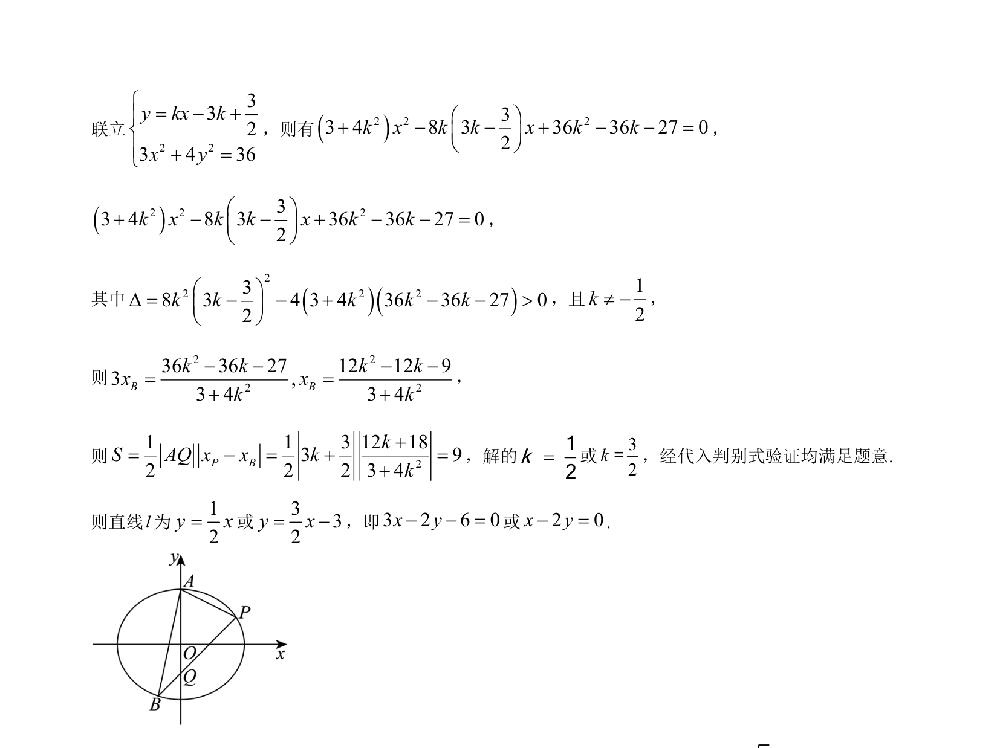

## 题面

## 摘要

椭圆中求离心率和直线方程，综合运用点到直线距离、联立方程等解法。

## 关联考点

- [[061-方程|椭圆的标准方程]]
- [[391-椭圆离心率|离心率]]
- [[1211-点到直线距离|点到直线的距离]]
- [[015-位置|直线与椭圆的位置关系]]

## 答案与解析

> 📄 原 PDF 第 11 页：`素材/真题/湖南/2008-2024·（湖南）数学高考真题/2024年高考数学试卷（新课标Ⅰ卷）（解析卷）.pdf`

<!-- 题干文本-start -->
## 题干文本
16. 已知(0,3)A和33,2Pæ öç ÷è ø
为椭圆
2 22 2: 1( 0)x yC a ba b+ = > >上两点.
（1）求 C的离心率;
（2）若过 P的直线l交 C于另一点 B，且ABPV的面积为 9，求l的方程．
<!-- 题干文本-end -->

<!-- 解析文本-start -->
## 解析文本
【答案】 （1）12    
（2）直线l的方程为3 2 6 0x y- - =或2 0x y- =.
【解析】
【分析】 （1）代入两点得到关于,a b的方程，解出即可；
（2）方法一：以AP为底，求出三角形的高，即点B到直线AP的距离，再利用平行线距离公式得到平移
后的直线方程，联立椭圆方程得到B点坐标，则得到直线l的方程；方法二：同法一得到点B到直线AP的
距离，再设()0 0,B x y，根据点到直线距离和点在椭圆上得到方程组，解出即可；法三：同法一得到点B到
直线AP的距离，利用椭圆的参数方程即可求解；法四：首先验证直线AB斜率不存在的情况，再设直线
3y kx= +，联立椭圆方程，得到点B坐标，再利用点到直线距离公式即可；法五：首先考虑直线PB斜率
不存在的情况，再设3: ( 3)2PB y k x- = -，利用弦长公式和点到直线的距离公式即可得到答案；法六：设
线法与法五一致，利用水平宽乘铅锤高乘12表达面积即可.
【小问 1 详解】
由题意得
2 239941ba b=ìïïíï+ =ïî
，解得
22912baì=í=î
，
所以
229 11 112 2bea= - = - =.
<!-- 解析文本-end -->
