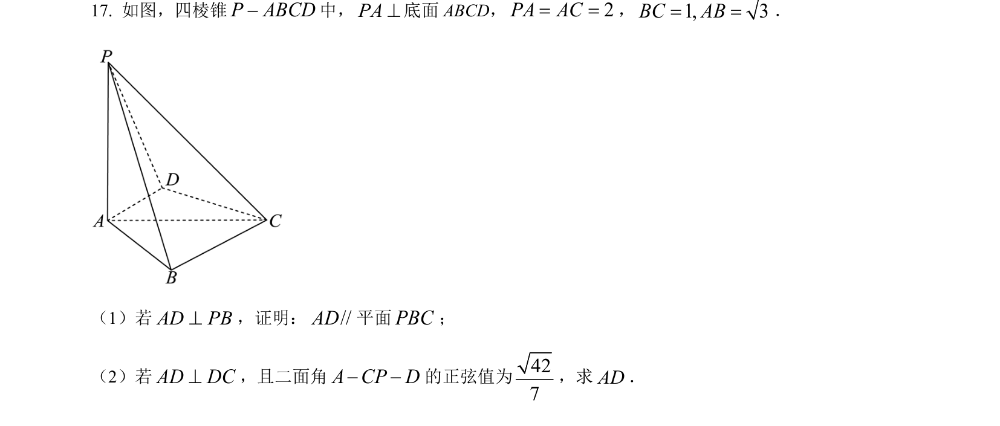
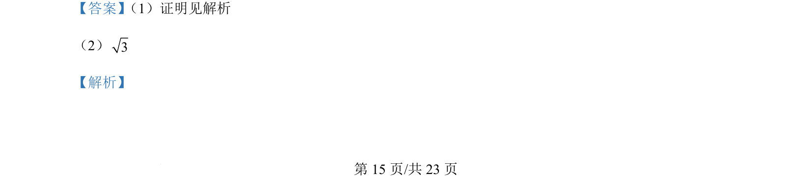
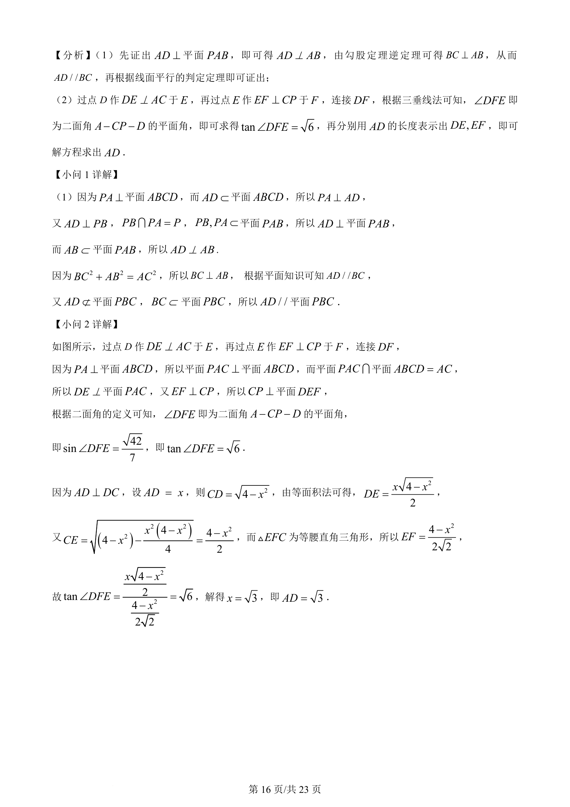
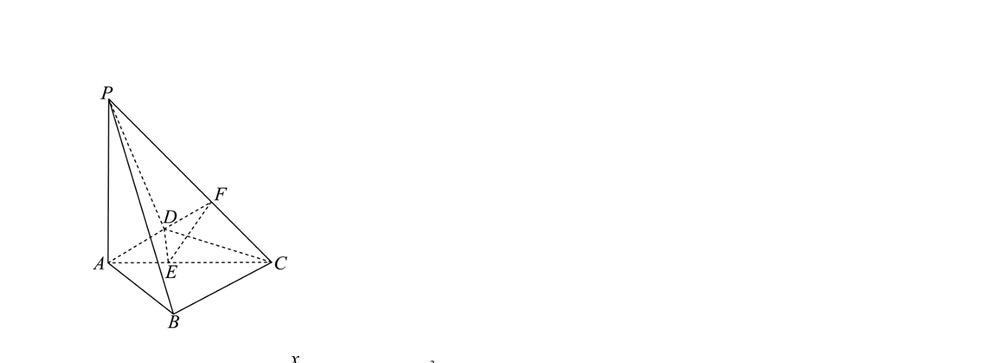

## 题面

## 摘要

考查线面平行判定与二面角的求解，涉及垂直关系的转化与平面角的构造。

## 关联考点

- [[1086-线面垂直的判定与性质|线面垂直]]
- [[352-空间直线平面平行|线面平行]]
- [[353-空间角|二面角]]

## 答案与解析

> 📄 原 PDF 第 15 页：`素材/真题/湖南/2008-2024·（湖南）数学高考真题/2024年高考数学试卷（新课标Ⅰ卷）（解析卷）.pdf`
