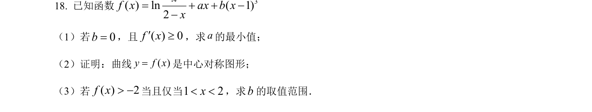
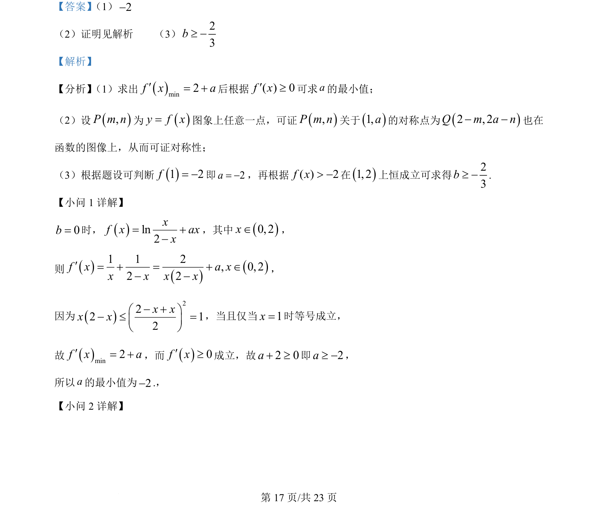
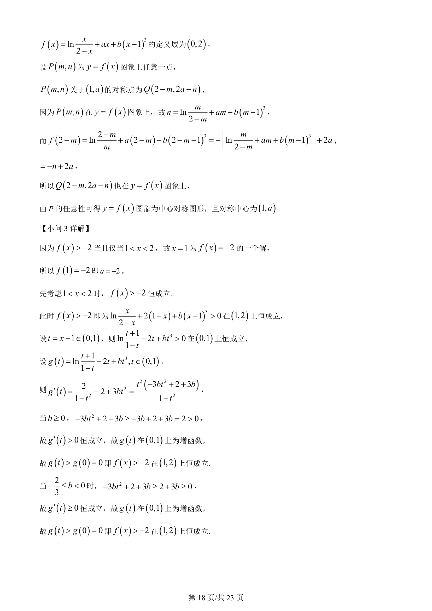
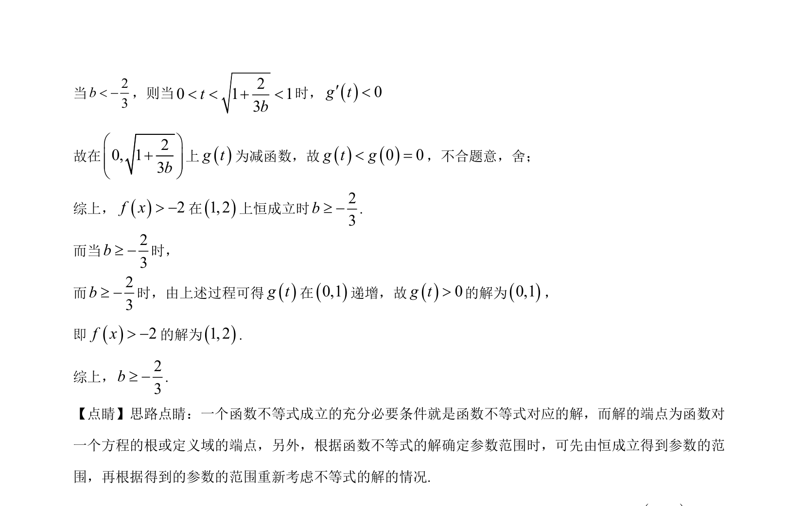

## 题面

## 摘要

考查含参函数最值与对称性证明，结合恒成立条件求参数范围。

## 关联考点

- [[1292-导数的应用|导数应用]]
- [[681-函数对称性|函数对称性]]
- [[参数恒成立]]
- [[913-最值问题|最值问题]]

## 答案与解析

> 📄 原 PDF 第 17 页：`素材/真题/湖南/2008-2024·（湖南）数学高考真题/2024年高考数学试卷（新课标Ⅰ卷）（解析卷）.pdf`
