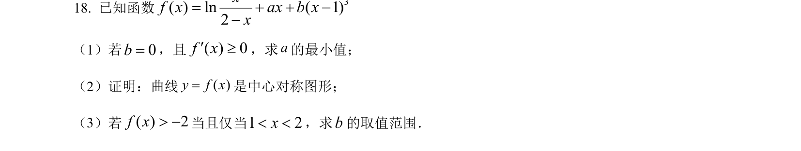
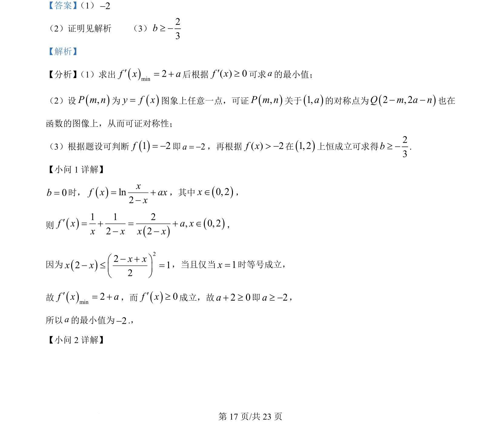
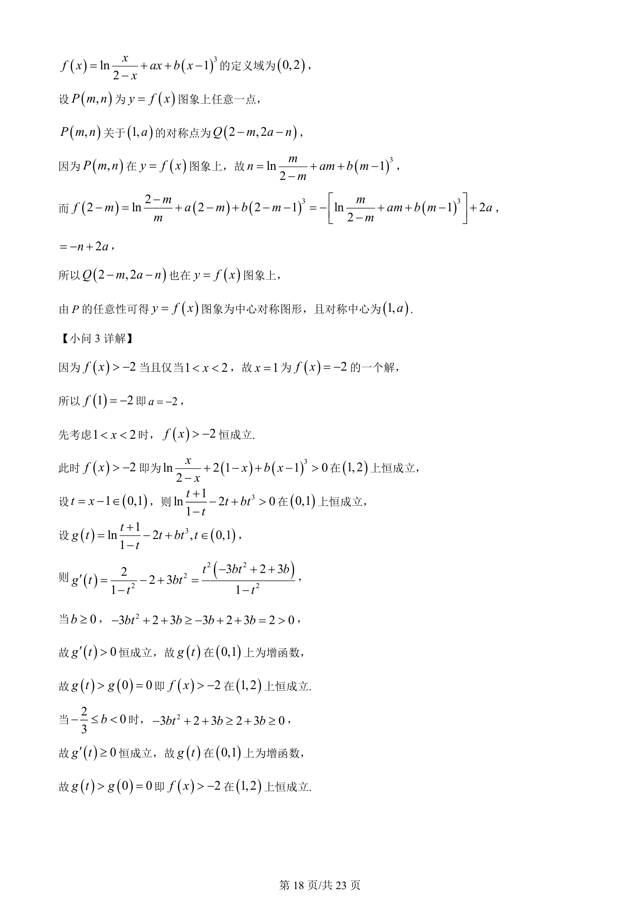
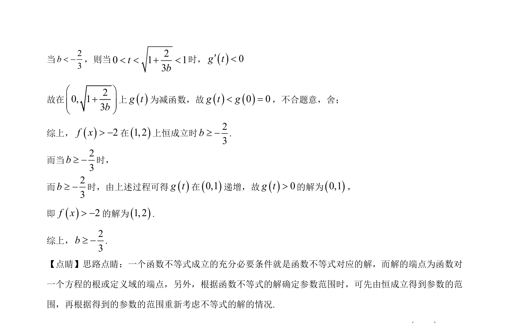

## 题面

## 摘要

考查含参函数最值与对称性证明，结合恒成立条件求参数范围。

## 关联考点

- [[1292-导数的应用|导数应用]]
- [[681-函数对称性|函数对称性]]
- [[参数恒成立]]
- [[913-最值问题|最值问题]]

## 答案与解析

> 📄 原 PDF 第 17 页：`素材/真题/湖南/2008-2024·（湖南）数学高考真题/2024年高考数学试卷（新课标Ⅰ卷）（解析卷）.pdf`

<!-- 题干文本-start -->
## 题干文本
18. 已知函数 3( ) ln ( 1)2xf x ax b xx= + + --
（1）若0b=，且( ) 0fx¢³，求a的最小值；
（2）证明：曲线( )y f x=是中心对称图形；
（3）若( ) 2f x> -当且仅当1 2x< <，求b的取值范围．
<!-- 题干文本-end -->

<!-- 解析文本-start -->
## 解析文本
【答案】 （1）2-    
（2）证明见解析    （3）23b³ -
【解析】
【分析】 （1）求出min2f x a¢= +后根据( ) 0fx¢³可求a的最小值；
（2）设,P m n为y f x=图象上任意一点，可证,P m n关于1,a的对称点为2 , 2Q m a n- -也在
函数的图像上，从而可证对称性；
（3）根据题设可判断1 2f= -即2a= -，再根据( ) 2f x> -在1, 2上恒成立可求得23b³ -.
【小问 1 详解】
0b=时，ln2xf x axx= +-
，其中0, 2xÎ，
则1 1 2, 0, 22 2f x a xx x x x= + = + Î- -¢ ，
因为222 12x xx x- +æ ö- £ =ç ÷è ø
，当且仅当1x=时等号成立，
故min2f x a¢= +，而0f x¢³成立，故2 0a+ ³即2a³ -，
所以a的最小值为2-.，
【小问 2 详解】
<!-- 解析文本-end -->
