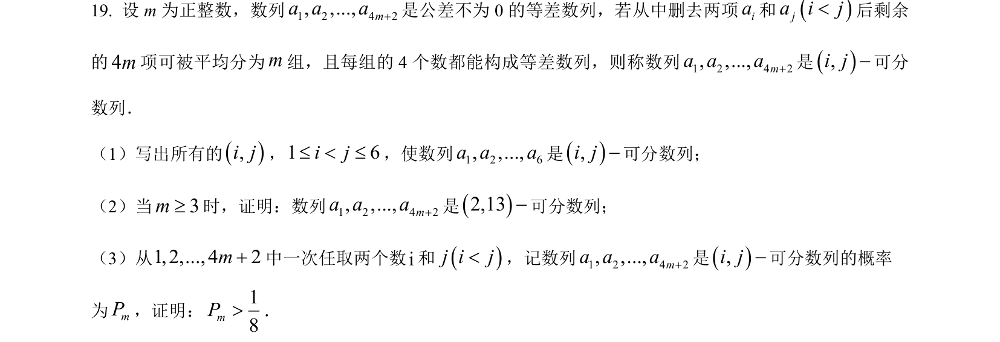
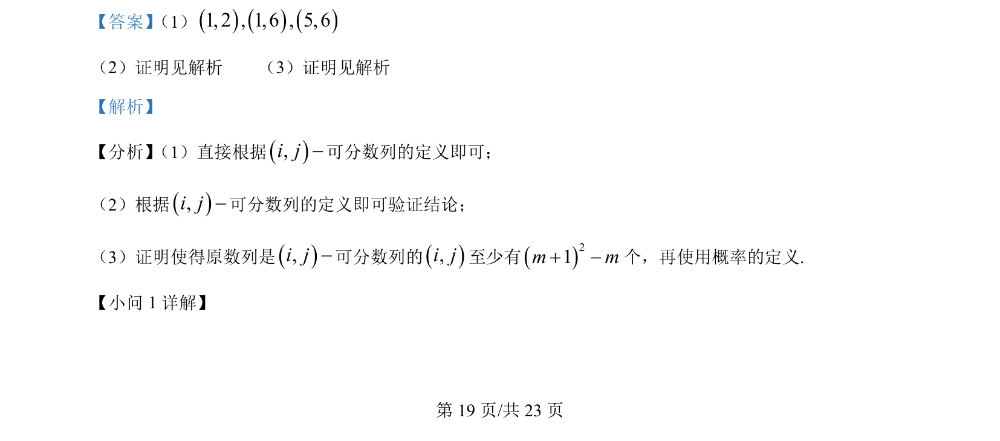
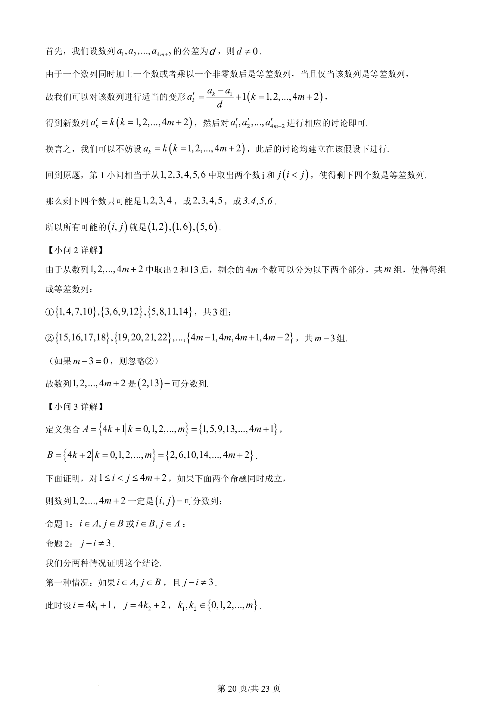
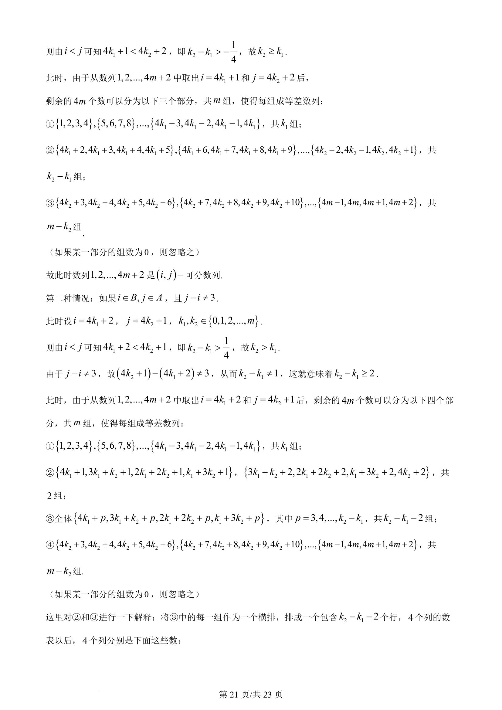
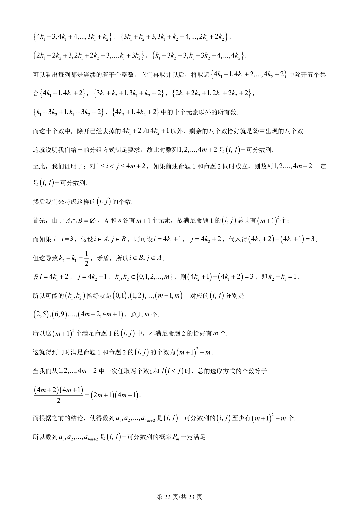
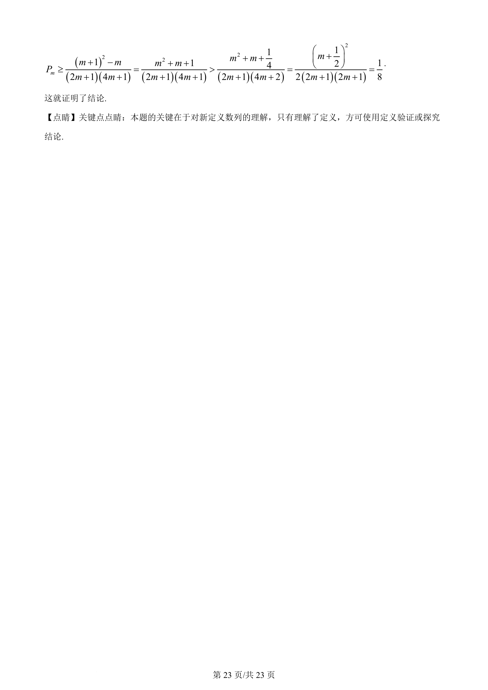

## 题面

## 摘要

考查等差数列可分数列的定义、验证及概率问题，涉及数列构造与计数。

## 关联考点

- [[356-等差数列概念|等差数列]]
- [[数列构造]]
- [[概率定义]]
- [[1090-组合计数|组合计数]]

## 答案与解析

> 📄 原 PDF 第 19 页：`素材/真题/湖南/2008-2024·（湖南）数学高考真题/2024年高考数学试卷（新课标Ⅰ卷）（解析卷）.pdf`
