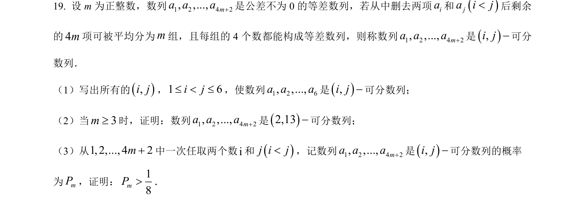
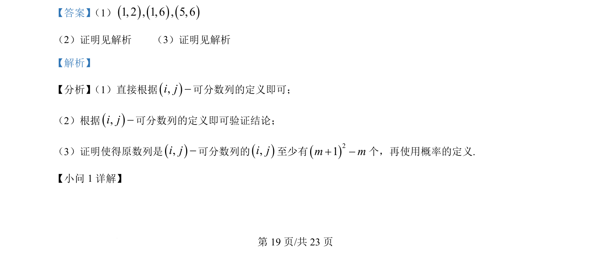
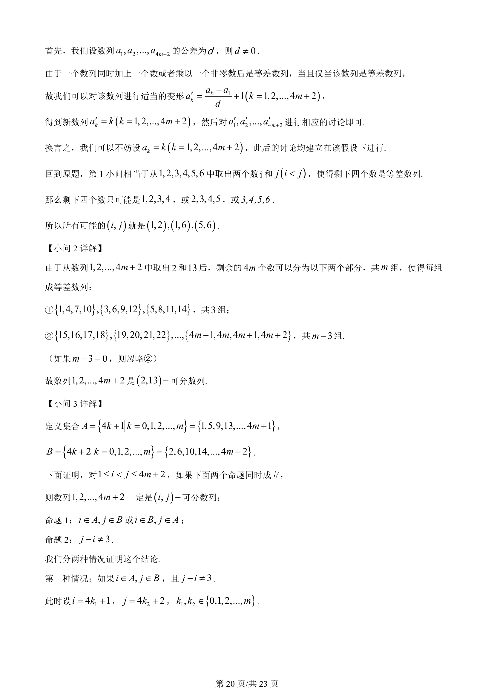
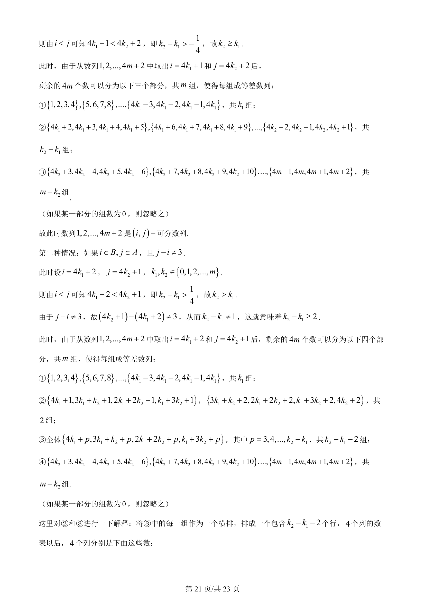
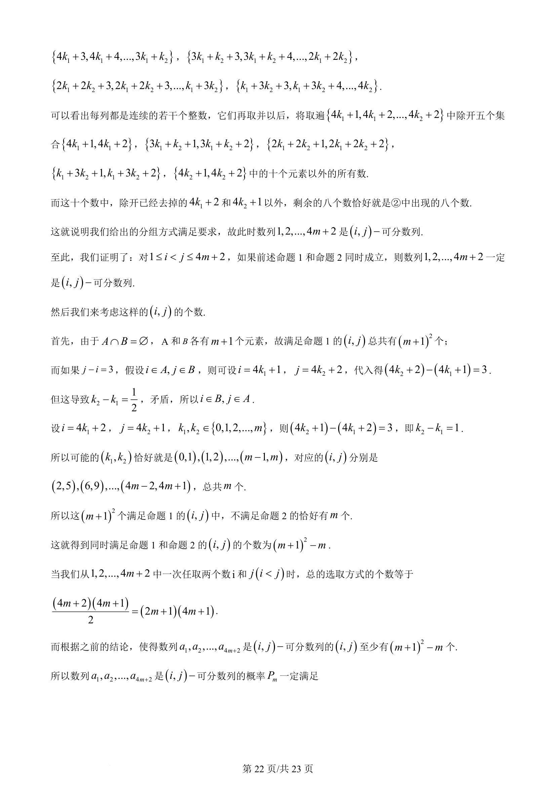
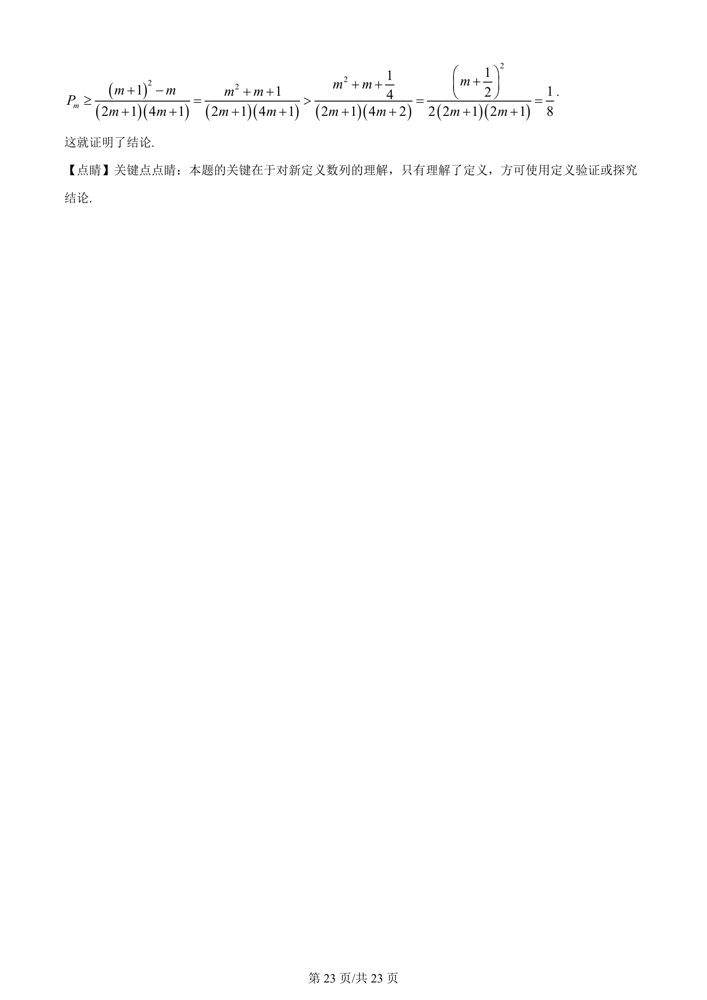

## 题面

## 摘要

考查等差数列可分数列的定义、验证及概率问题，涉及数列构造与计数。

## 关联考点

- [[356-等差数列概念|等差数列]]
- [[数列构造]]
- [[概率定义]]
- [[1090-组合计数|组合计数]]

## 答案与解析

> 📄 原 PDF 第 19 页：`素材/真题/湖南/2008-2024·（湖南）数学高考真题/2024年高考数学试卷（新课标Ⅰ卷）（解析卷）.pdf`

<!-- 题干文本-start -->
## 题干文本
19. 设 m 为正整数，数列1 2 4 2, ,...,ma a a+是公差不为 0 的等差数列，若从中删去两项ia和ja i j<后剩余
的4m项可被平均分为m组，且每组的 4 个数都能构成等差数列，则称数列1 2 4 2, ,...,ma a a+是,i j-可分
数列．
（1）写出所有的,i j，1 6i j£ < £，使数列1 2 6, ,...,a a a是,i j-可分数列；
（2）当3m³时，证明：数列1 2 4 2, ,...,ma a a+是2,13-可分数列；
（3）从1, 2,..., 4 2m+中一次任取两个数i和j i j<，记数列1 2 4 2, ,...,ma a a+是,i j-可分数列的概率
为mP，证明：18mP>．
<!-- 题干文本-end -->

<!-- 解析文本-start -->
## 解析文本
【答案】 （1）1, 2 , 1,6 , 5,6    
（2）证明见解析    （3）证明见解析
【解析】
【分析】 （1）直接根据,i j-可分数列的定义即可；
（2）根据,i j-可分数列的定义即可验证结论；
（3）证明使得原数列是,i j-可分数列的,i j至少有21m m+ -个，再使用概率的定义.
【小问 1 详解】
<!-- 解析文本-end -->
