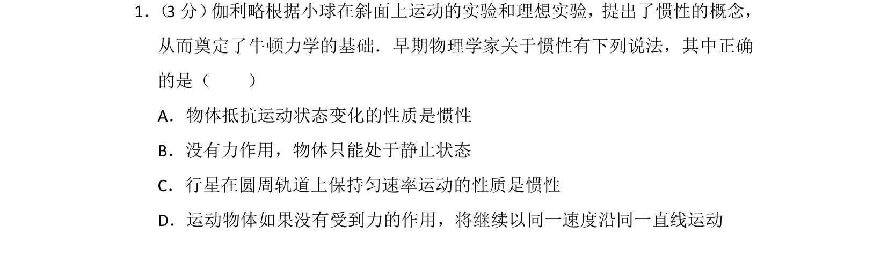
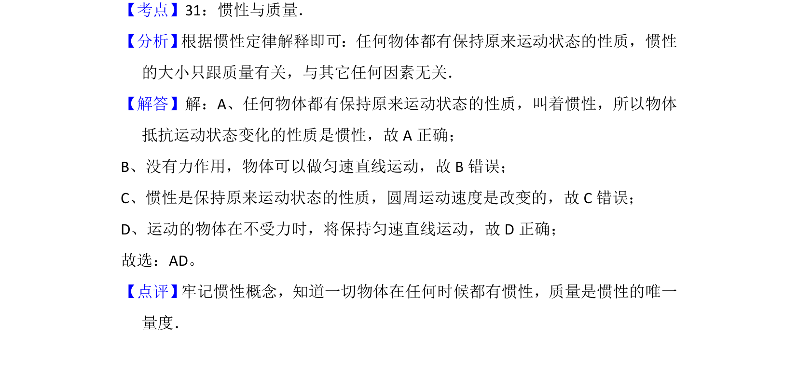

## 题面

## 摘要

伽利略惯性实验与概念辨析，判断关于惯性的正确说法

## 关联考点

- [[080-惯性|惯性]]
- [[100-牛顿第一定律|牛顿第一定律]]
- [[734-运动状态|运动状态]]

## 答案与解析

> 📄 原 PDF 第 1 页：`素材/真题/湖南/2008-2024·（湖南）物理高考真题/2012年高考物理试卷（新课标）（解析卷）.pdf`

<!-- 题干文本-start -->
## 题干文本
1． （3分） 伽利略根据小球在斜面上运动的实验和理想实验，提出了惯性的概念，
从而奠定了牛顿力学的基础．早期物理学家关于惯性有下列说法，其中正确
的是（　　）
A．物体抵抗运动状态变化的性质是惯性
B．没有力作用，物体只能处于静止状态
C．行星在圆周轨道上保持匀速率运动的性质是惯性
D．运动物体如果没有受到力的作用，将继续以同一速度沿同一直线运动
<!-- 题干文本-end -->

<!-- 解析文本-start -->
## 解析文本
【考点】31：惯性与质量．菁优网版权所有
【分析】 根据惯性定律解释即可：任何物体都有保持原来运动状态的性质，惯性
的大小只跟质量有关，与其它任何因素无关．
【解答】解：A、任何物体都有保持原来运动状态的性质，叫着惯性，所以物体
抵抗运动状态变化的性质是惯性，故A正确；
B、没有力作用，物体可以做匀速直线运动，故B错误；
C、惯性是保持原来运动状态的性质，圆周运动速度是改变的，故C错误；
D、运动的物体在不受力时，将保持匀速直线运动，故D正确；
故选：AD。
【点评】 牢记惯性概念，知道一切物体在任何时候都有惯性，质量是惯性的唯一
量度．
<!-- 解析文本-end -->
