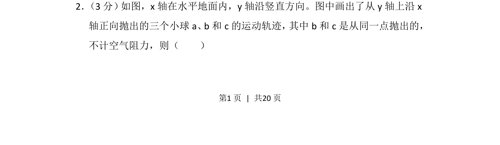

## 题面

## 摘要

三个小球做平抛运动的轨迹比较，考查运动时间与初速度的定性分析

## 关联考点

- [[261-平抛运动|平抛运动]]
- [[运动时间]]
- [[初速度]]
- [[737-运动轨迹分析|轨迹分析]]

## 答案与解析

> 📄 原 PDF 第 1 页：`素材/真题/湖南/2008-2024·（湖南）物理高考真题/2012年高考物理试卷（新课标）（解析卷）.pdf`

<!-- 题干文本-start -->
## 题干文本
2． （3分） 如图，x轴在水平地面内，y轴沿竖直方向。图中画出了从y轴上沿x
轴正向抛出的三个小球a、b和c的运动轨迹， 其中b和c是从同一点抛出的，
不计空气阻力，则（　　）
<!-- 题干文本-end -->

<!-- 解析文本-start -->
## 解析文本

<!-- 解析文本-end -->
