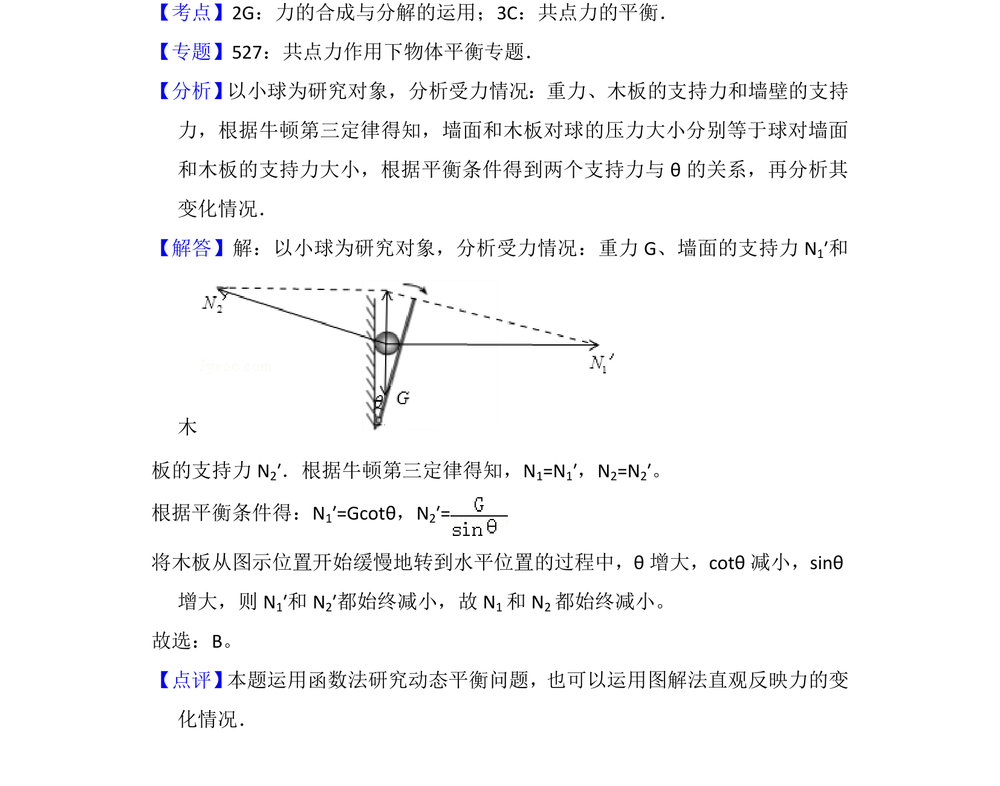

## 题面

## 摘要

木板缓慢转动过程中，小球在重力、墙面弹力和木板弹力作用下动态平衡，分析两力变化规律。

## 关联考点

- [[208-共点力平衡|共点力平衡]]
- [[284-化学平衡|动态平衡]]
- [[532-力的合成与分解|力的合成与分解]]

## 答案与解析

> 📄 原 PDF 第 2 页：`素材/真题/湖南/2008-2024·（湖南）物理高考真题/2012年高考物理试卷（新课标）（解析卷）.pdf`
