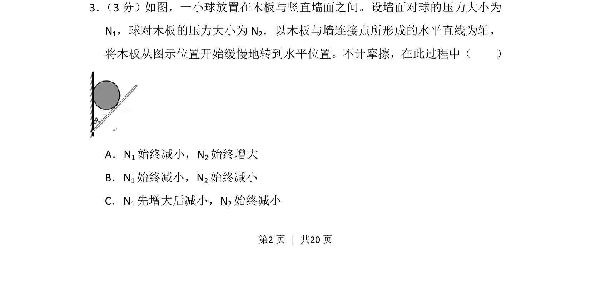
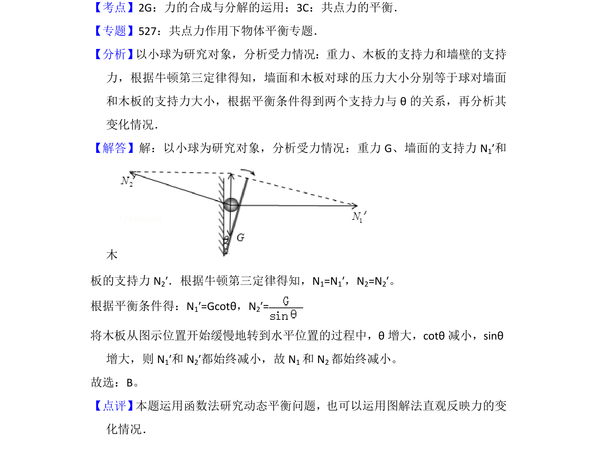

## 题面

## 摘要

木板缓慢转动过程中，小球在重力、墙面弹力和木板弹力作用下动态平衡，分析两力变化规律。

## 关联考点

- [[208-共点力平衡|共点力平衡]]
- [[284-化学平衡|动态平衡]]
- [[532-力的合成与分解|力的合成与分解]]

## 答案与解析

> 📄 原 PDF 第 2 页：`素材/真题/湖南/2008-2024·（湖南）物理高考真题/2012年高考物理试卷（新课标）（解析卷）.pdf`

<!-- 题干文本-start -->
## 题干文本
3． （3分）如图，一小球放置在木板与竖直墙面之间。设墙面对球的压力大小为
N1，球对木板的压力大小为N 2．以木板与墙连接点所形成的水平直线为轴，
将木板从图示位置开始缓慢地转到水平位置。不计摩擦，在此过程中（　　）
A．N1始终减小，N2始终增大
B．N1始终减小，N2始终减小
C．N1先增大后减小，N2始终减小
<!-- 题干文本-end -->

<!-- 解析文本-start -->
## 解析文本

<!-- 解析文本-end -->
