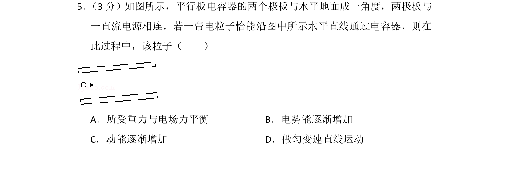
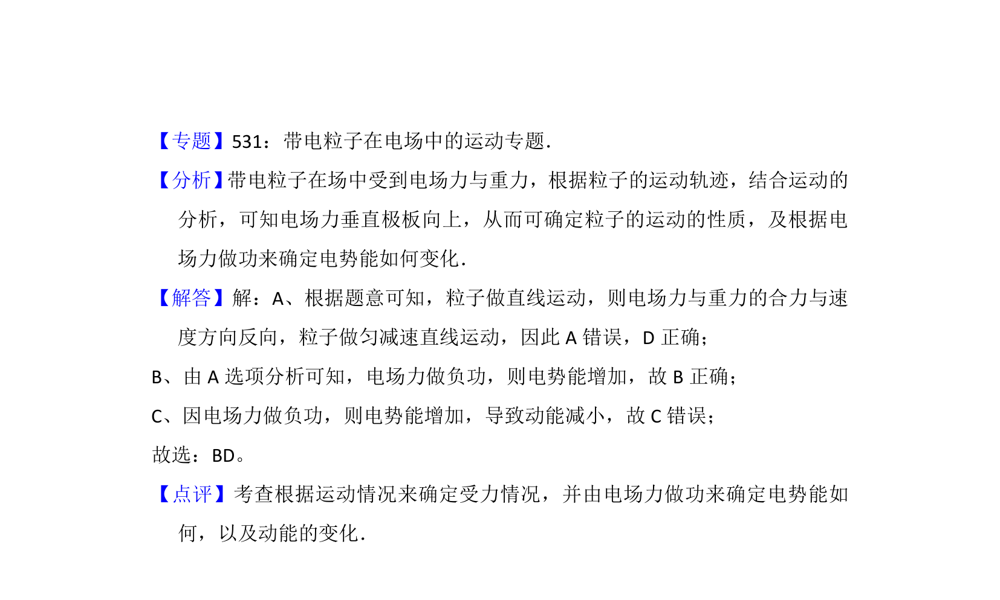

## 题面

## 摘要

带电粒子在倾斜平行板电容器中沿水平直线运动，分析其受力、能量变化及运动性质。

## 关联考点

- [[844-带电粒子在复合场中的运动|带电粒子在复合场中的运动]]
- [[276-电势能|电势能]]
- [[251-动能定理|动能定理]]
- [[215-匀变速直线运动|匀变速直线运动]]

## 答案与解析

> 📄 原 PDF 第 4 页：`素材/真题/湖南/2008-2024·（湖南）物理高考真题/2012年高考物理试卷（新课标）（解析卷）.pdf`
