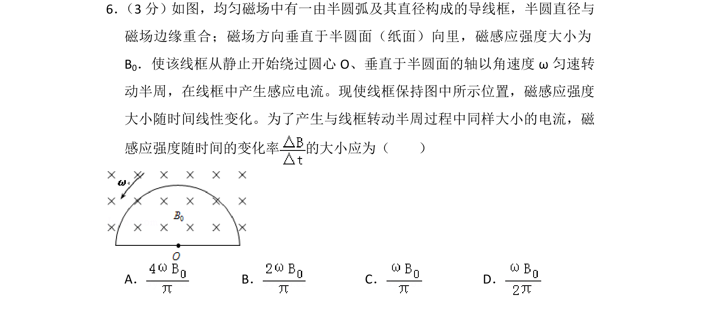
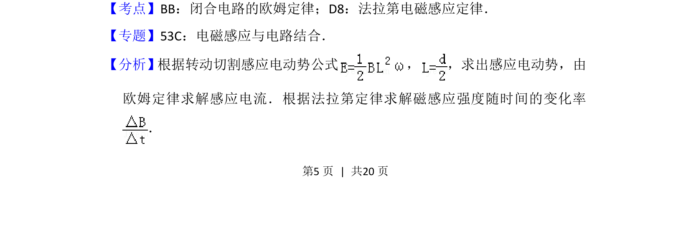
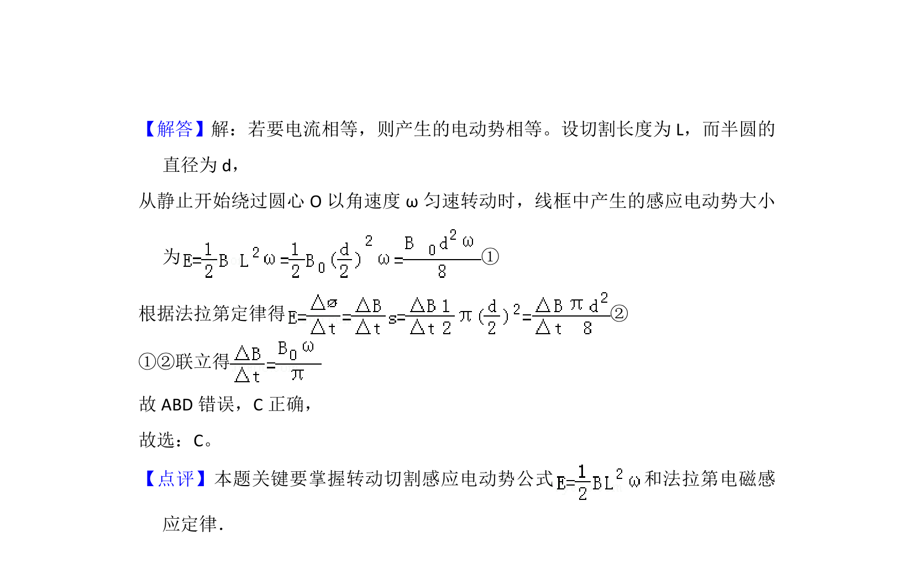

## 题面

## 摘要

线框在磁场中转动切割与磁感应强度变化两种方式产生感应电流的大小比较，求磁感应强度变化率。

## 关联考点

- [[395-法拉第电磁感应定律|法拉第电磁感应定律]]
- [[332-闭合电路欧姆定律|闭合电路欧姆定律]]
- [[转动切割电动势]]

## 答案与解析

> 📄 原 PDF 第 5 页：`素材/真题/湖南/2008-2024·（湖南）物理高考真题/2012年高考物理试卷（新课标）（解析卷）.pdf`
