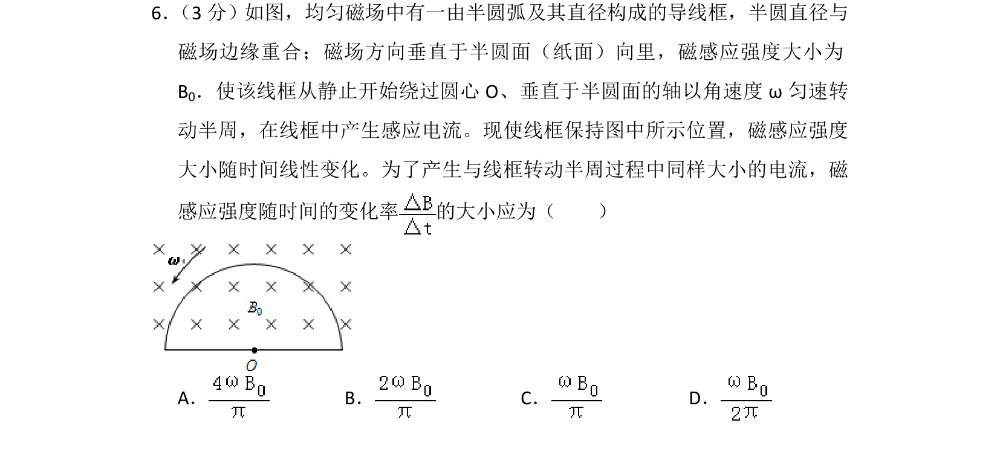
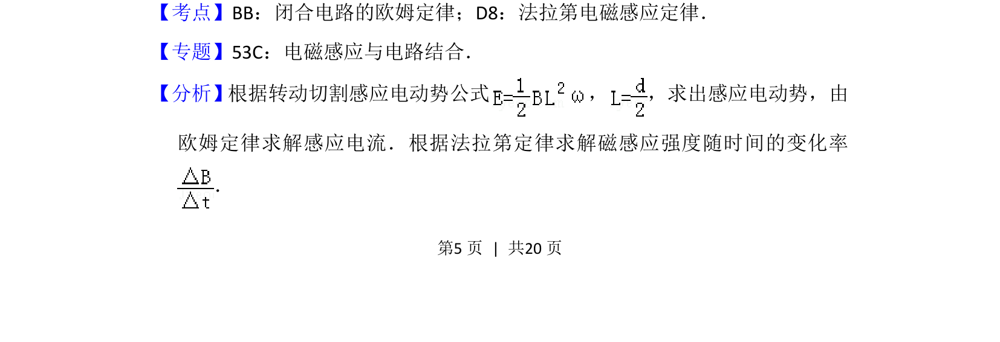
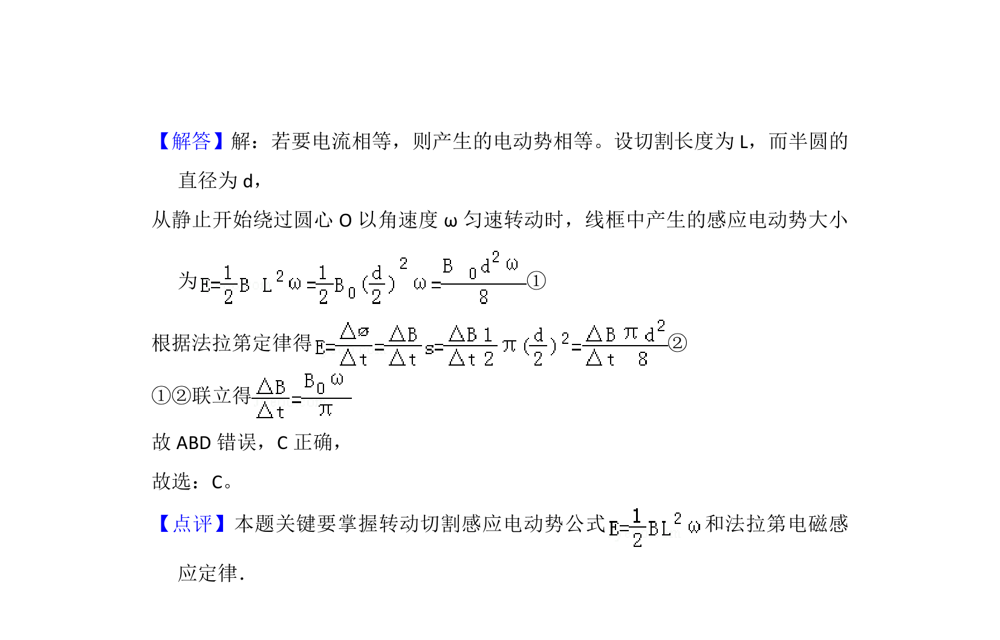

## 题面

## 摘要

线框在磁场中转动切割与磁感应强度变化两种方式产生感应电流的大小比较，求磁感应强度变化率。

## 关联考点

- [[395-法拉第电磁感应定律|法拉第电磁感应定律]]
- [[332-闭合电路欧姆定律|闭合电路欧姆定律]]
- [[转动切割电动势]]

## 答案与解析

> 📄 原 PDF 第 5 页：`素材/真题/湖南/2008-2024·（湖南）物理高考真题/2012年高考物理试卷（新课标）（解析卷）.pdf`

<!-- 题干文本-start -->
## 题干文本
6． （3分）如图，均匀磁场中有一由半圆弧及其直径构成的导线框，半圆直径与
磁场边缘重合；磁场方向垂直于半圆面（纸面）向里，磁感应强度大小为
B0．使该线框从静止开始绕过圆心O、垂直于半圆面的轴以角速度ω匀速转
动半周，在线框中产生感应电流。现使线框保持图中所示位置，磁感应强度
大小随时间线性变化。为了产生与线框转动半周过程中同样大小的电流，磁
感应强度随时间的变化率 的大小应为（　　）
A．B．C．D．
<!-- 题干文本-end -->

<!-- 解析文本-start -->
## 解析文本
【考点】BB：闭合电路的欧姆定律；D8：法拉第电磁感应定律．菁优网版权所有
【专题】53C：电磁感应与电路结合．
【分析】根据转动切割感应电动势公式 ， ，求出感应电动势，由
欧姆定律求解感应电流．根据法拉第定律求解磁感应强度随时间的变化率
．
<!-- 解析文本-end -->
