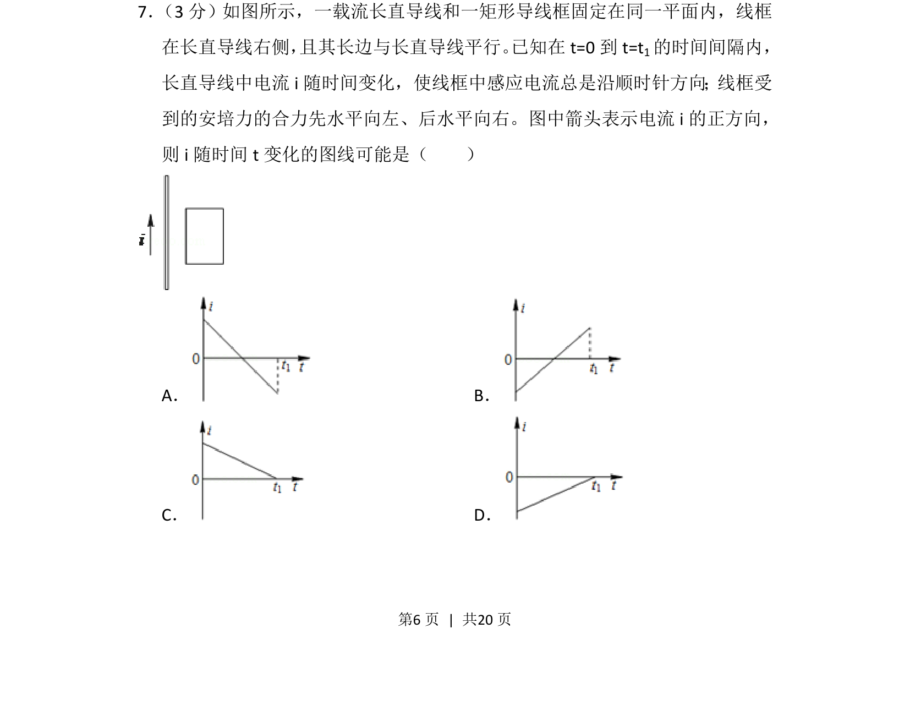
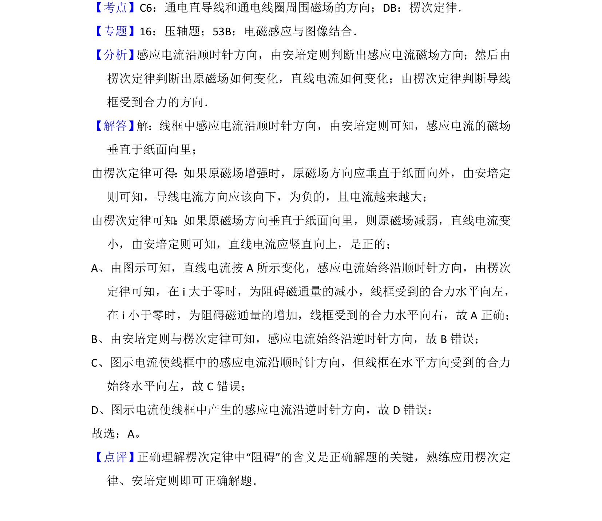

## 题面

## 摘要

通过线框中感应电流方向和安培力方向变化，逆向判断载流直导线电流i的图线。

## 关联考点

- [[393-楞次定律|楞次定律]]
- [[188-磁场对通电导体的作用|安培力]]
- [[175-电磁感应|电磁感应]]

## 答案与解析

> 📄 原 PDF 第 6 页：`素材/真题/湖南/2008-2024·（湖南）物理高考真题/2012年高考物理试卷（新课标）（解析卷）.pdf`
