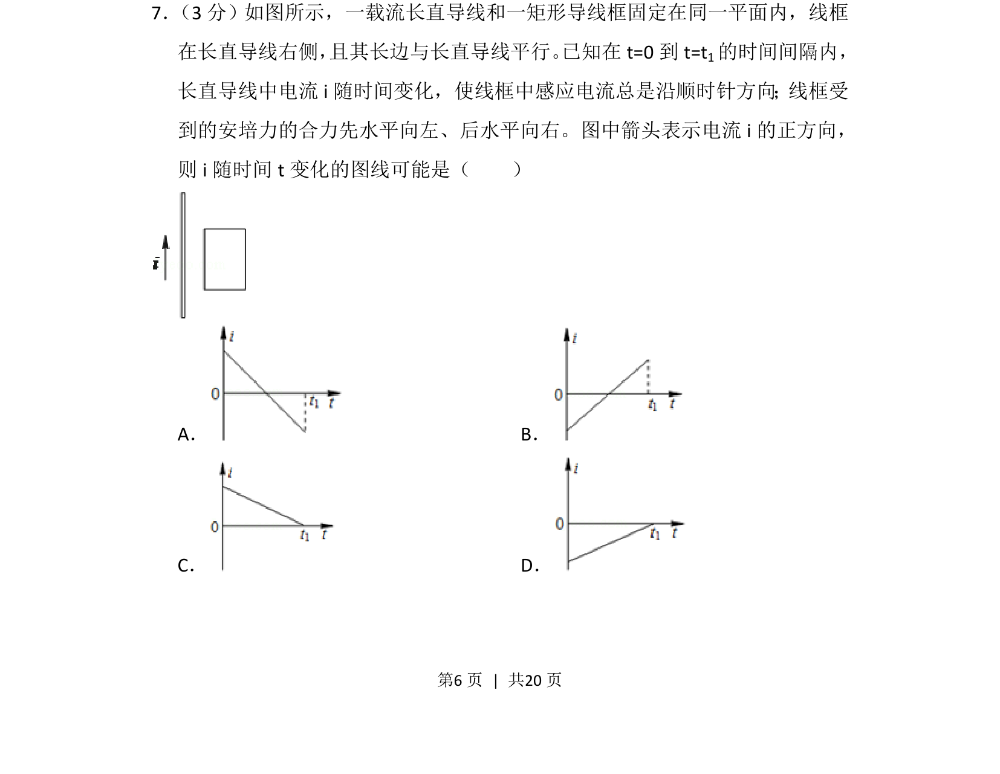
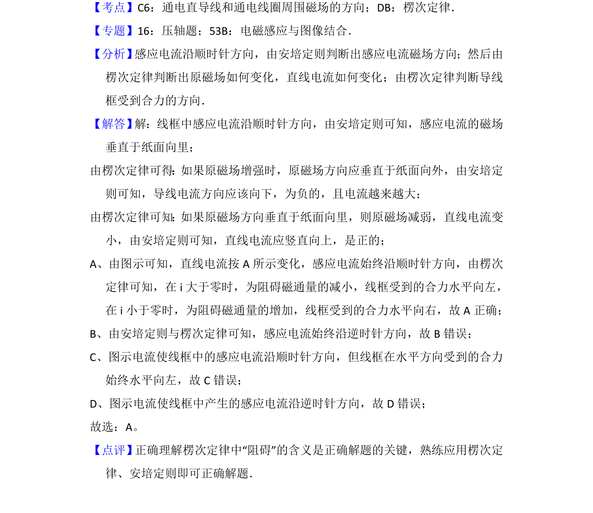

## 题面

## 摘要

通过线框中感应电流方向和安培力方向变化，逆向判断载流直导线电流i的图线。

## 关联考点

- [[393-楞次定律|楞次定律]]
- [[188-磁场对通电导体的作用|安培力]]
- [[175-电磁感应|电磁感应]]

## 答案与解析

> 📄 原 PDF 第 6 页：`素材/真题/湖南/2008-2024·（湖南）物理高考真题/2012年高考物理试卷（新课标）（解析卷）.pdf`

<!-- 题干文本-start -->
## 题干文本
7． （3分）如图所示，一载流长直导线和一矩形导线框固定在同一平面内，线框
在长直导线右侧， 且其长边与长直导线平行。 已知在t=0到t=t1的时间间隔内，
长直导线中电流i随时间变化，使线框中感应电流总是沿顺时针方向；线框受
到的安培力的合力先水平向左、后水平向右。图中箭头表示电流i的正方向，
则i随时间t变化的图线可能是（　　）
A．B．
C．D．
<!-- 题干文本-end -->

<!-- 解析文本-start -->
## 解析文本

<!-- 解析文本-end -->
