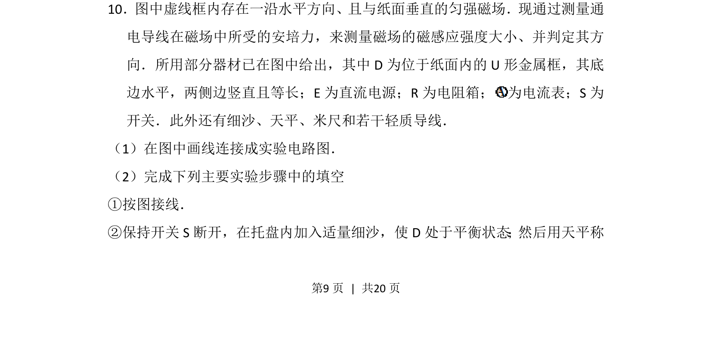
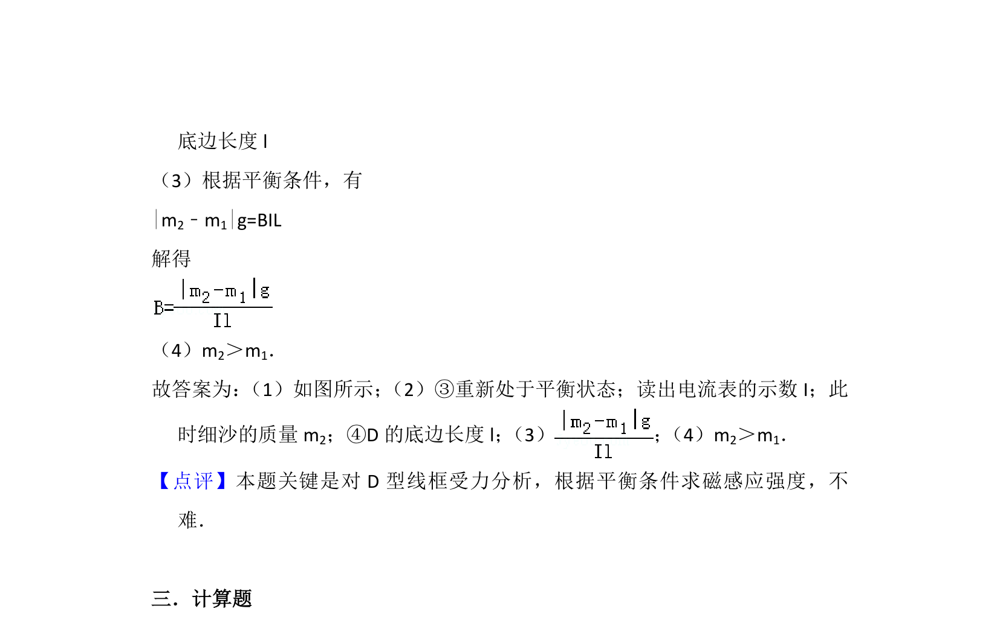

## 题面

## 摘要

基于安培力平衡法测量匀强磁场磁感应强度及方向的实验设计与操作

## 关联考点

- [[188-磁场对通电导体的作用|安培力]]
- [[323-磁感应强度|磁感应强度]]
- [[208-共点力平衡|共点力平衡]]
- [[电路连接]]

## 答案与解析

> 📄 原 PDF 第 9 页：`素材/真题/湖南/2008-2024·（湖南）物理高考真题/2012年高考物理试卷（新课标）（解析卷）.pdf`
