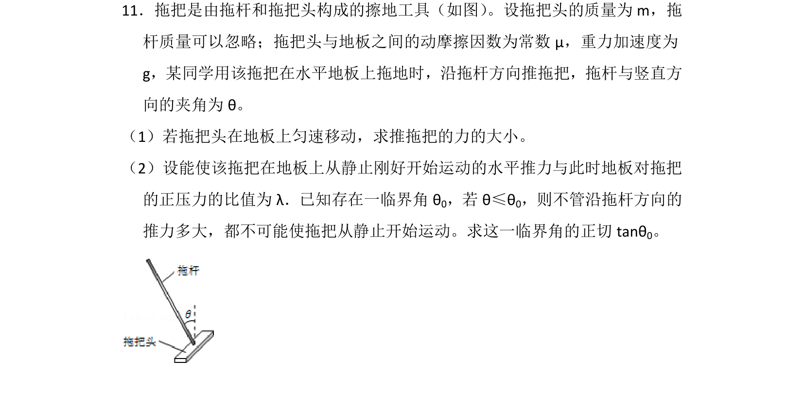
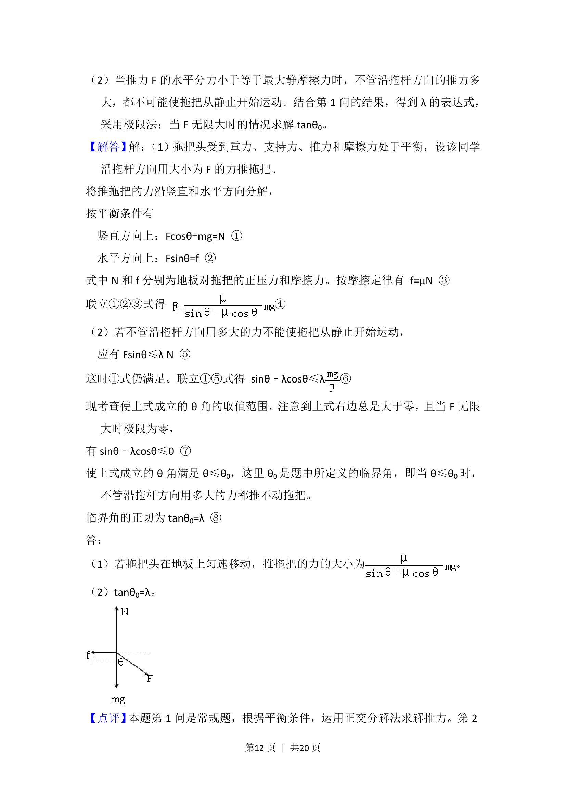

## 题面

## 摘要

拖把拖地问题中的正交分解与平衡条件应用，求解推力大小及临界角正切值。

## 关联考点

- [[532-力的合成与分解|力的合成与分解]]
- [[783-共点力的平衡|共点力的平衡]]
- [[475-正交分解法|正交分解法]]

## 答案与解析

> 📄 原 PDF 第 11 页：`素材/真题/湖南/2008-2024·（湖南）物理高考真题/2012年高考物理试卷（新课标）（解析卷）.pdf`
