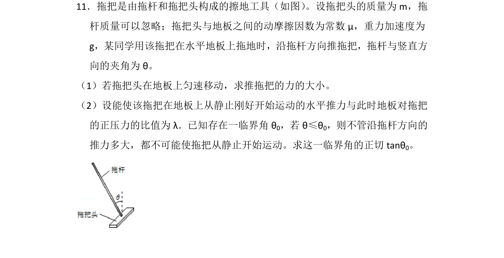
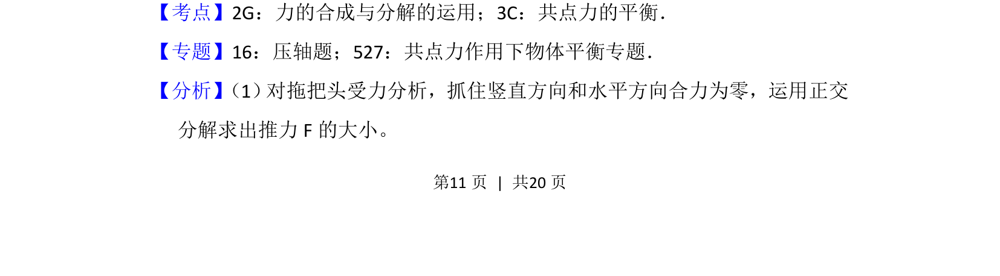
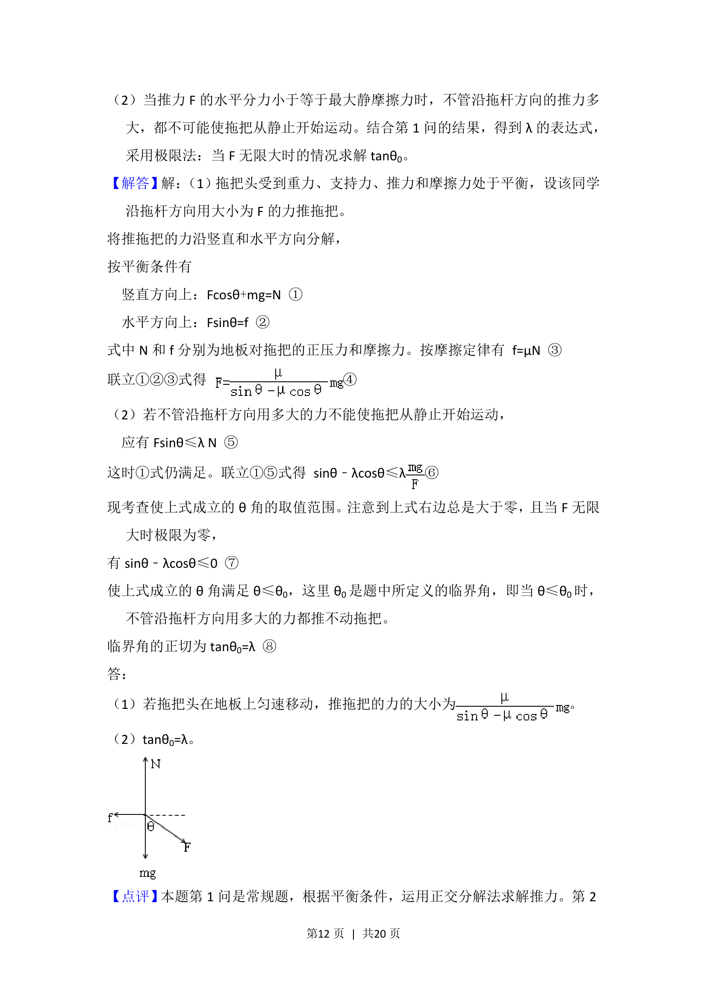
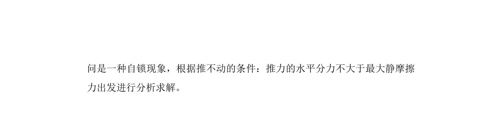

## 题面

## 摘要

拖把拖地问题中的正交分解与平衡条件应用，求解推力大小及临界角正切值。

## 关联考点

- [[532-力的合成与分解|力的合成与分解]]
- [[208-共点力平衡|共点力的平衡]]
- [[475-正交分解法|正交分解法]]

## 答案与解析

> 📄 原 PDF 第 11 页：`素材/真题/湖南/2008-2024·（湖南）物理高考真题/2012年高考物理试卷（新课标）（解析卷）.pdf`

<!-- 题干文本-start -->
## 题干文本
11．拖把是由拖杆和拖把头构成的擦地工具（如图） 。设拖把头的质量为m，拖
杆质量可以忽略；拖把头与地板之间的动摩擦因数为常数μ，重力加速度为
g，某同学用该拖把在水平地板上拖地时，沿拖杆方向推拖把，拖杆与竖直方
向的夹角为θ。
（1）若拖把头在地板上匀速移动，求推拖把的力的大小。
（2）设能使该拖把在地板上从静止刚好开始运动的水平推力与此时地板对拖把
的正压力的比值为λ．已知存在一临界角θ 0，若θ≤θ 0，则不管沿拖杆方向的
推力多大，都不可能使拖把从静止开始运动。求这一临界角的正切tanθ 0。
<!-- 题干文本-end -->

<!-- 解析文本-start -->
## 解析文本
【考点】2G：力的合成与分解的运用；3C：共点力的平衡．菁优网版权所有
【专题】16：压轴题；527：共点力作用下物体平衡专题．
【分析】 （1） 对拖把头受力分析，抓住竖直方向和水平方向合力为零，运用正交
分解求出推力F的大小。
<!-- 解析文本-end -->
