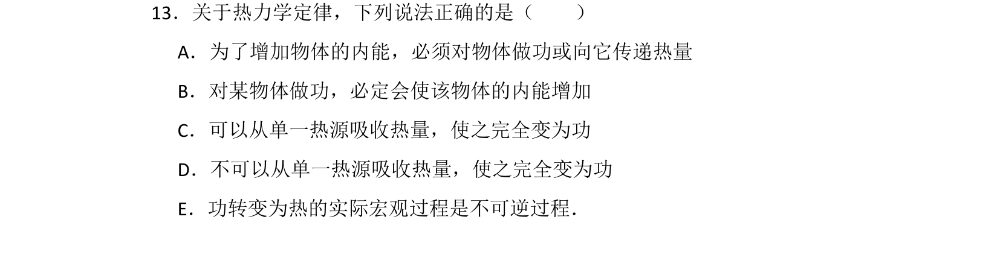
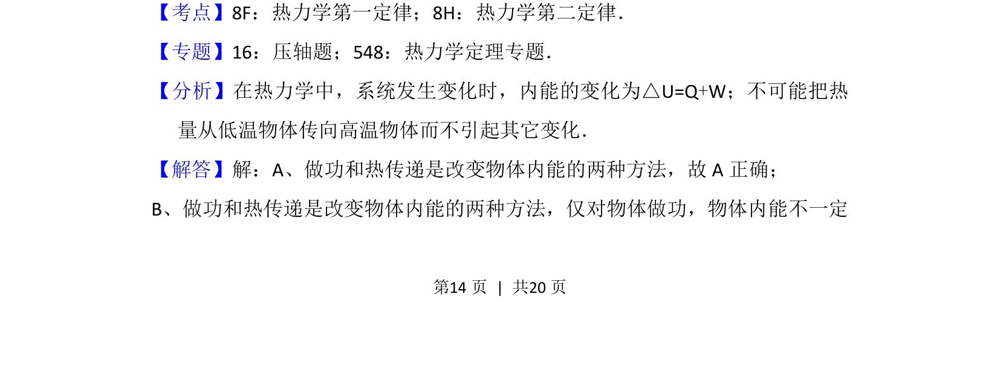
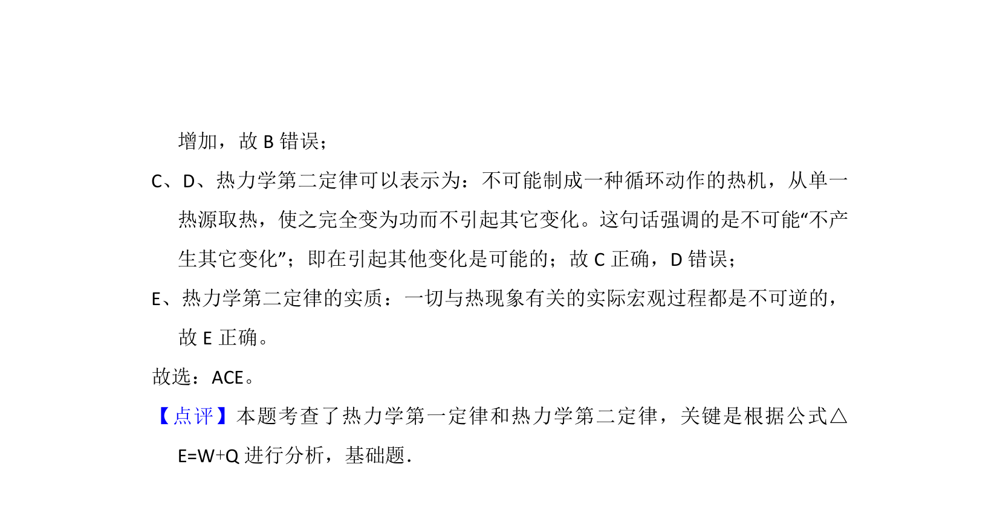

## 题面

## 摘要

考查热力学第一定律和第二定律的基本概念，判断内能改变方式及热力学过程的方向性。

## 关联考点

- [[440-热力学第一定律|热力学第一定律]]
- [[441-热力学第二定律|热力学第二定律]]
- [[内能改变]]
- [[502-不可逆过程|不可逆过程]]

## 答案与解析

> 📄 原 PDF 第 14 页：`素材/真题/湖南/2008-2024·（湖南）物理高考真题/2012年高考物理试卷（新课标）（解析卷）.pdf`
