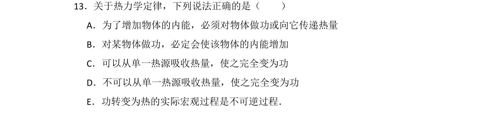
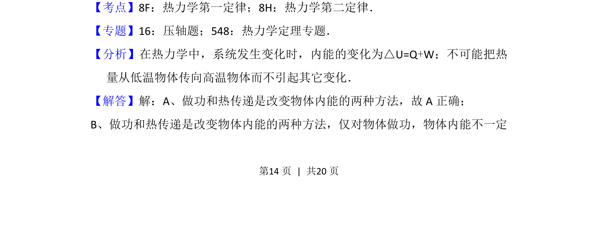
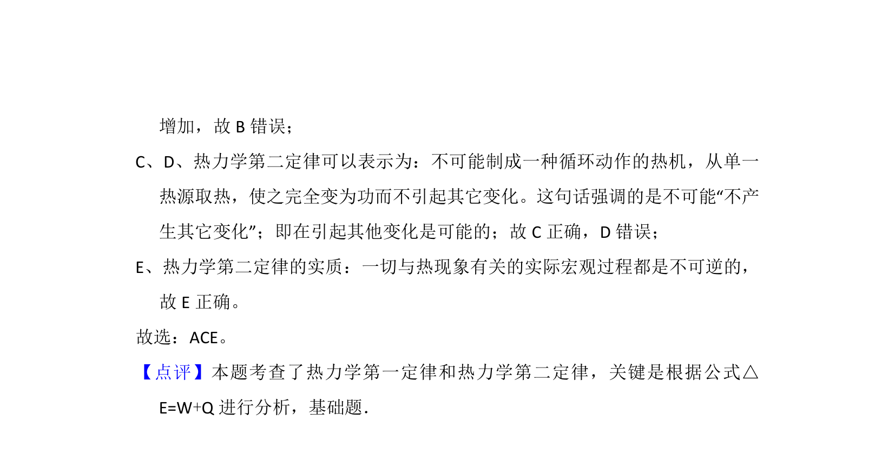

## 题面

## 摘要

考查热力学第一定律和第二定律的基本概念，判断内能改变方式及热力学过程的方向性。

## 关联考点

- [[440-热力学第一定律|热力学第一定律]]
- [[441-热力学第二定律|热力学第二定律]]
- [[内能改变]]
- [[502-不可逆过程|不可逆过程]]

## 答案与解析

> 📄 原 PDF 第 14 页：`素材/真题/湖南/2008-2024·（湖南）物理高考真题/2012年高考物理试卷（新课标）（解析卷）.pdf`

<!-- 题干文本-start -->
## 题干文本
13．关于热力学定律，下列说法正确的是（　　）
A．为了增加物体的内能，必须对物体做功或向它传递热量
B．对某物体做功，必定会使该物体的内能增加
C．可以从单一热源吸收热量，使之完全变为功
D．不可以从单一热源吸收热量，使之完全变为功
E．功转变为热的实际宏观过程是不可逆过程．
<!-- 题干文本-end -->

<!-- 解析文本-start -->
## 解析文本
【考点】8F：热力学第一定律；8H：热力学第二定律．菁优网版权所有
【专题】16：压轴题；548：热力学定理专题．
【分析】在热力学中，系统发生变化时，内能的变化为△U=Q+W；不可能把热
量从低温物体传向高温物体而不引起其它变化．
【解答】解：A、做功和热传递是改变物体内能的两种方法，故A正确；
B、做功和热传递是改变物体内能的两种方法，仅对物体做功，物体内能不一定
<!-- 解析文本-end -->
